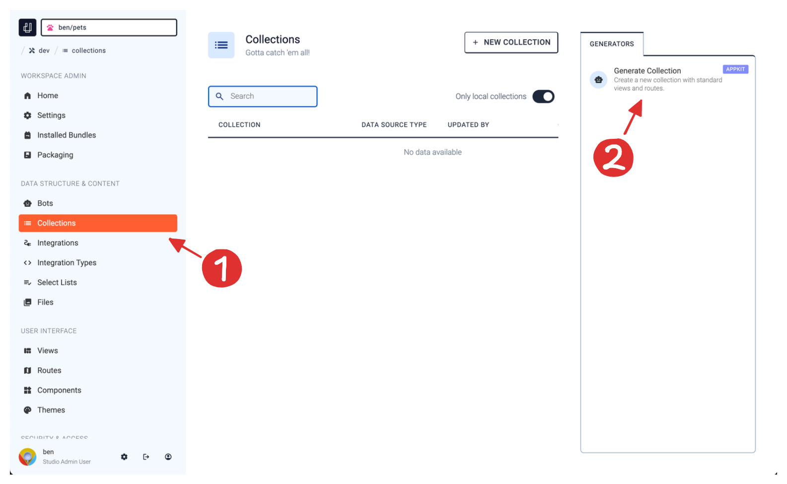
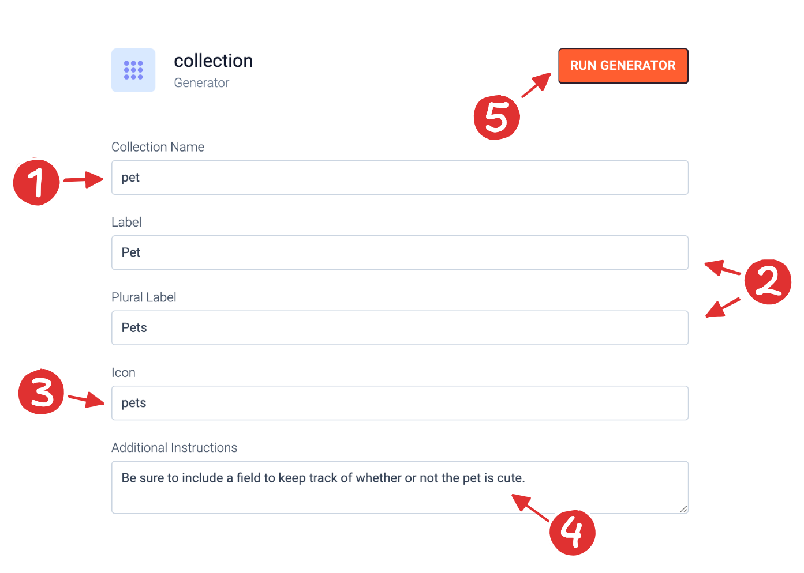
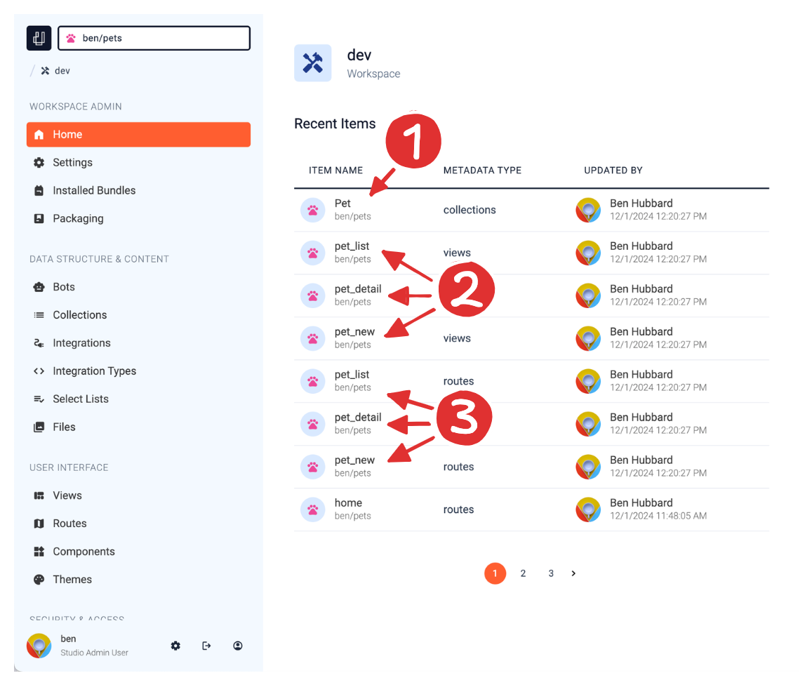
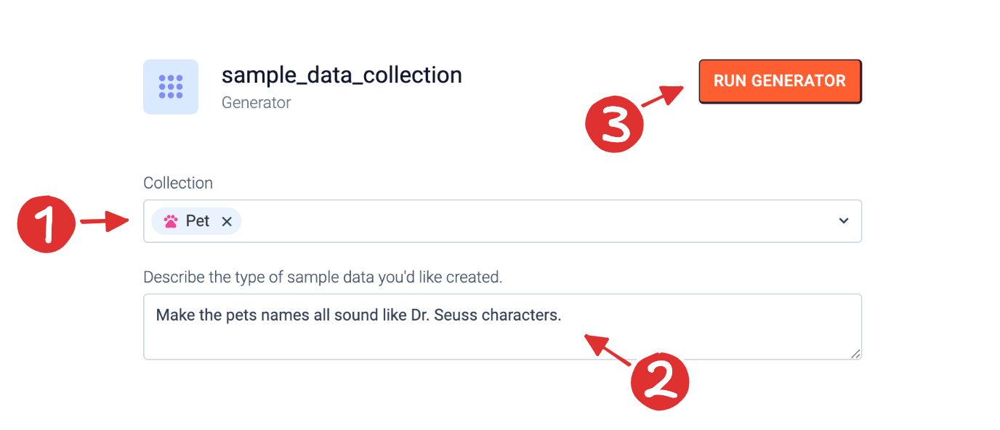
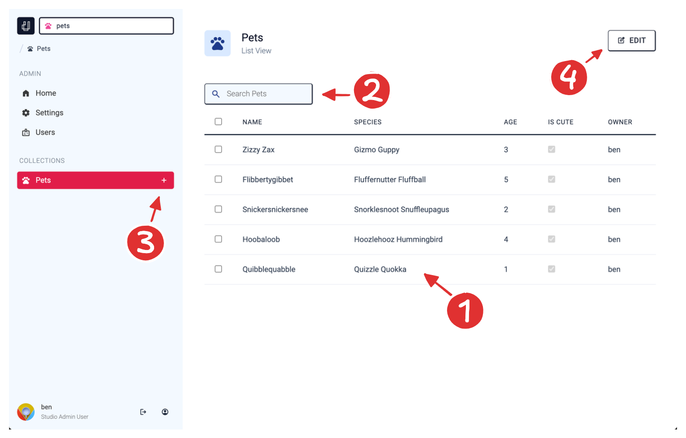

Now that you've created an app and ran the App Kit starter template, you have a scaffold for your app. You have a "dev" workspace for making changes and you have a "prod" site already built out with simple user management and home and settings screens. Now you're ready to start working with data. To do that, we'll explore the concept of ues.io generators. They'll help you build out functionality for your app quickly and in a standard way.

## What are Generators?

As we already briefly mentioned in the Starter Templates section of the "Create your first App" guide, generators are scripts that do their work at build-time instead of run-time. There are other types of bots in ues.io that are for run-time. (We'll get into those in a later guide.)

Generators automate the process of building common patterns in your apps. They can be packaged just like any other type of metadata. That means that marketplace apps can provide not only run-time capabilities for other apps, but can also build-time ones. In this guide we'll be exploring the capabilities of the generators that come with the App Kit bundle.

## Generate a Collection

To continue building out our pet management app from earlier guides, we'll use an App Kit generator to create a "pet" collection for us to store our pet data records. This generator will also create admin screens for this collection.

### 1. Collection List View

From your app home screen, click on the "dev" workspace. Then in the workspace navigation sidebar, select the "Collections" menu item in the "Data Structure & Content" category. This should bring up the collections list view as shown above.

### 2. "Generate Collection" Generator

On the collections list view, you'll see a list of all the collections currently in your app. Since this is a brand new app, there are collections yet. In the right panel, you'll see a list of available generators to run that are related to collections. (Other packages you install may add additional generators to this list.) Click on the App Kit "Generate Collection" generator.

## Generator Parameters

This generator has a few parameters we need to fill in before it will run. The generator uses these parameters to determine how it functions. Let's fill in the values for our demo app.

### 1. Collection Name

Let's call our collection "pet". It's best practice in ues.io to use singular collection names. This keeps things consistent in our app as well as in apps installed from the marketplace. The App Kit generator will use an AI model to generate fields for this collection based on this name.

### 2. Collection Labels

Give singular and plural labels to your collection. These labels can be used throughout the app for a better user experience. It is best practice to start your labels with capital letters. You are welcome to use spaces in collection labels.

### 3. Collection Icon

Add a Material Icons icon name here. For this guide, just use "pets". This will give your collection the same icon as your app. This is fine since pets will be the primary collection.

### 4. Additional Instructions

Since this generator will be using an AI model to generate fields, you can give it some additional instructions about fields you definitely want or would want excluded. For this example I just added a silly instruction. Feel free to add whatever you want here or leave it blank.

### 5. Run Generator

Once all of the parameters are filled in, you can run the generator. (Note: Since we're using an AI model to determine which fields are created, this may take a few seconds to complete.)

## Results Tour

When the generator is done running, you'll land back on the workspace home screen. However, you'll notice that quite a few items now exist in your recent metadata items that weren't there before. Let's dive into what was created.

### 1. The Pets Collection

First of all, the generator created a Pets collection. This is where we'll store each of our pet records. Click on this collection and verify that the AI model generated good fields for this collection. Also verify that it followed your instructions. In my case it did create an `is_cute` field of type CHECKBOX just as I instructed.

### 2. Admin Views

The generator also created three views for us. A "list" view, a "detail" view and a "create new" view for managing the pets collection. We'll go deeper into working with views with the View Builder in another guide. For now we can just use these views as is.

### 3. Admin Routes

In addition to creating views, the generator created routes for us as well. Routes link a view to a relative url inside your app. For example, the `pet_list` route makes the `pet_list` view available at the url `/pet`. The last thing that the generator did was create some route assignments. Route Assignments designate a route to be a cannonical route for that collection. This makes building generic navigation components and reference fields much easier. Components that know nothing about your application's structure can now easily navigate you to a detail view or list view for a collection.

## Sample Data

Now let's use another App Kit generator to populate our pets collection with some sample data. To do this, navigate to the collections list in the "dev" workspace, then click on the "pet" collection. In the right sidebar in the generators tab there should be a generator called "Generate Sample Data". Click on that generator to continue.

### 1. Pick the Collection

Select the "Pet" collection so the generator knows which collection to generate data for.

### 2. Additional Instructions

Here we can add some additional instructions to help guide the AI model in creating our sample data.

### 3. Run Generator

Click the "Run Generator" button. This will take a few seconds to create your data. Once it's done you'll land back on the workspace home screen.

Now let's check out our progress so far by previewing the routes the App Kit generator created.

## Previewing Routes

To preview a route in your workspace, click on the routes menu item in the left navigation sidebar of your workspace. It is in the "User Interface" grouping of metadata items. Once you're on the routes list page, click on the `pet_list` route to see details about that route. Finally, click the "Preview" button in the top right of the screen. This will let you preview your app at this route in "Workspace Mode". Workspace mode is a way to view the current state of your app in the workspace. This mode is only available inside the ues.io studio app to you or other members of your app's teams.

### 1. Navigate to detail view

Click on a record in the table to navigate to the detail view for that record.

### 2. Search

Use the search box to search for pets by name.

### 3. Create a new record

Use the plus button in the navigation sidebar to create a new pet record.

### 4. Edit records

Use the edit button to switch the table into edit mode. This will allow you to quickly edit your records.

## Next Steps

You've successfully used a few of the App Kit generators to add functionality to your app. However, your users in your "prod" site have not been affected by any of these changes. In the next guide, we'll go through packaging up your changes and deploying them to your sites.
