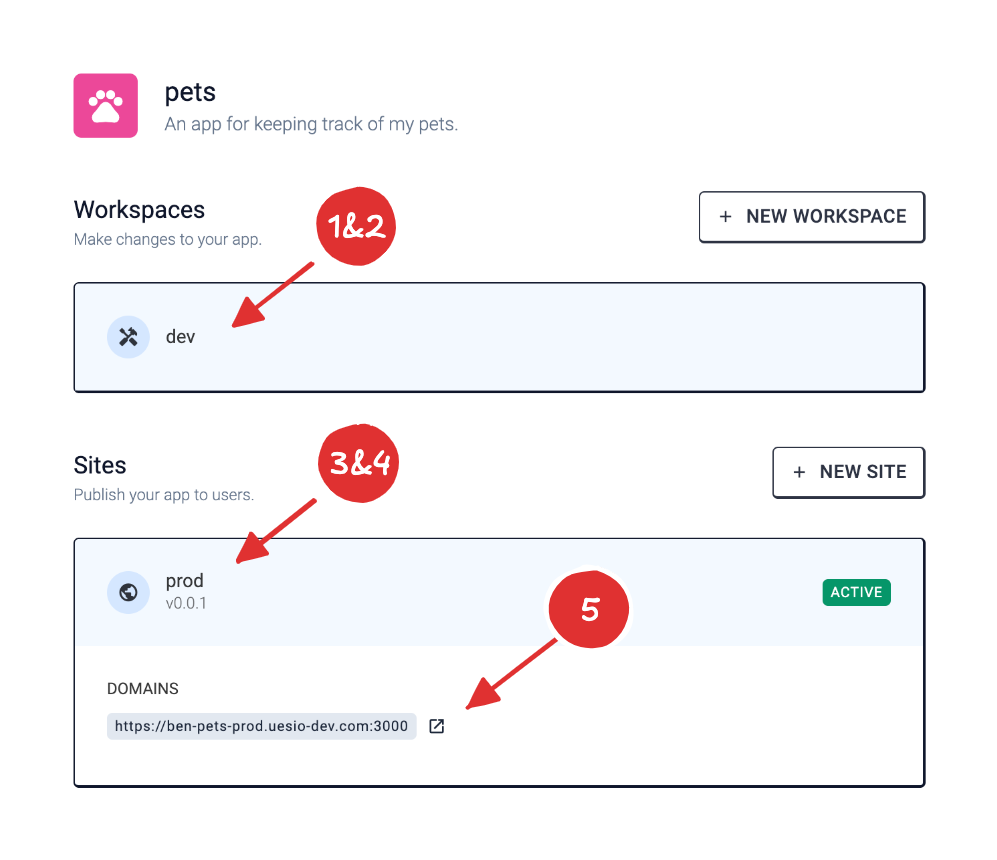
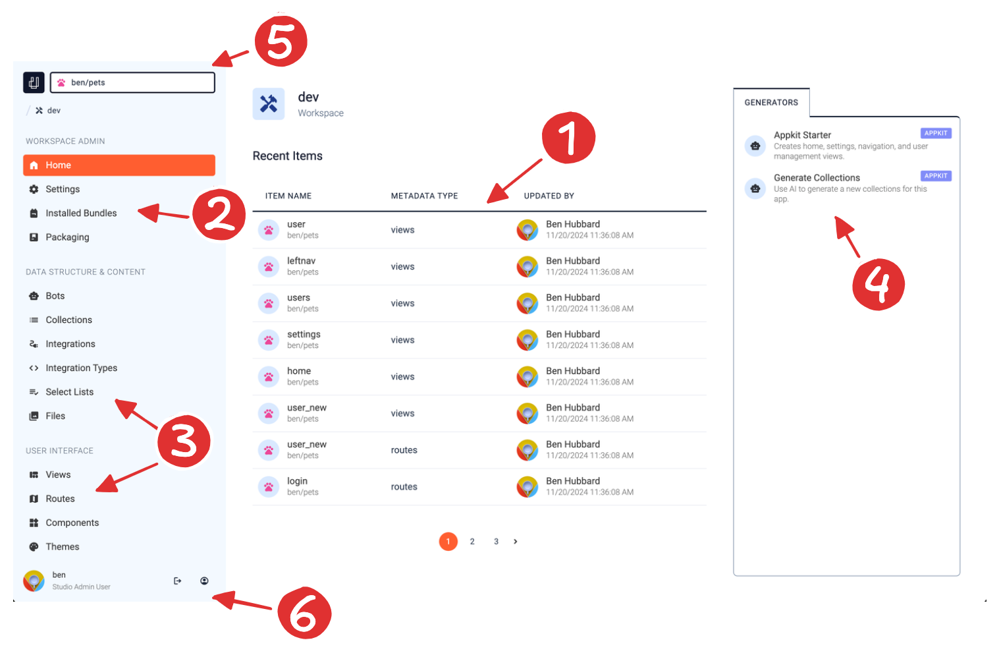
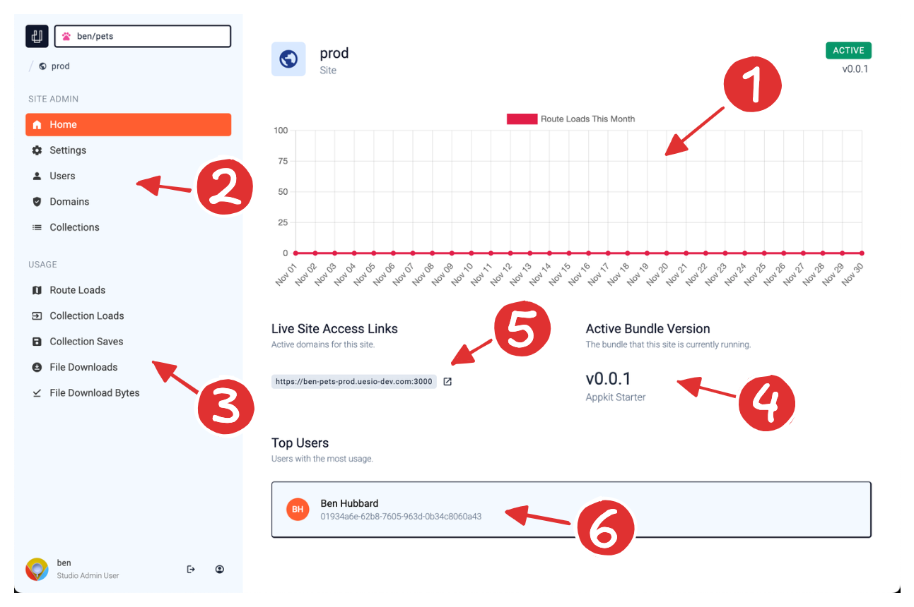

You just finished the "Create your first app" tutorial, and are on the app home screen of your newly created app. Let's dig in to what's here.

## App Home

The app home screen shows an app admin navigation section and a list of the Sites and Workspaces for this app. We'll start with a quick intro to workspaces and sites. Among other things, the App Kit starter template did six things automatically for you. (We'll go into the other things in more detail later.)

1. Created a workspace for you called "dev".
2. Installed itself into your workspace, and gave your app a license to use it.
3. Created a bundle of your new app with a version of "v0.0.1".
4. Created a site for you called "prod" that is using bundle version "v0.0.1".
5. Created a domain of type "subdomain" and name `<username-appname-sitename>` and assigned it to your prod site.
6. Created a user called `<your-username>` and gave them an admin profile in your app.

## Your First Workspace

The App Kit starter template created a new workspace for you called "dev". Click on the workspace to go to the workspace home.

A workspace is a named environment where you can make changes to an app's metadata. Workspaces are created from the app home screen, and can be either long-lived or transient.

For those familiar with Git, a workspace is similar to a Git branch. You could just have one workspace and do all your work there, or you could have one long-lived "main" workspace and have each team member do all of their work on short-lived "feature" workspaces, and merge changes into the "main" workspace with Git and a continuous-integration process.

Here's a quick overview of the workspace home screen.

### 1. Recent Items

Here you'll find all of the metadata items that were recently added to your workspace. There are items here because the App Kit starter template created some Views, Routes for the home, settings, and user management screens as well as Permission Sets, and Profiles for your admin and public (or unauthenticated) users. (We'll go into more detail on those items later.)

### 2. Workspace Administration

This is where you can adjust your workspace settings, see what bundles are installed in your workspace, and visit the bundlestore to install additional bundles. You can also create new versions of your app as a snapshot of the current state of this workspace. Those bundles can then be used in your sites to make your app available to your users.

### 3. Metadata Type Categories

The rest of the navigation bar contains links all of the different metadata types that can comprise a ues.io application. (Scroll down to see even more metadata types.)

### 4. Generators

These are the generators that are available for you to run in a workspace context. Installed bundles can add generators to this list. For now, you only have App Kit installed, so that is all of the generators you see. You just ran the "AppKit Starter" generator by creating your app with a starter template. We'll go into the "Generate Collections" generator in a later section of this guide.

### 5. App Header and Breadcrumbs

Click on the name of your app to go back to the app home page. The ues.io logo will take you back to the studio home where you can see all your apps.

### 6. User Toolbar

The User Toolbar is located in the bottom left of the navigation panel. Use this to log out or view your user settings.

## Your First Site

We won't make any changes to our app yet, so we can leave the "dev" workspace for now.

Next, we want to check out the site that the App Kit starter template created for us called "prod". Click on your app's name in the top left corner of the navigation panel to go back to the app home screen. Then click on the "prod" site.

Sites are how we publish our app to users. Each site is a separate "tenant" of the ues.io platform. That means any data in on site can never be accessed from another site. You may want multiple sites for different stages of the application lifecycle, like "prod", "uat", "dev", etc., but you can also use sites for different customers of your app. You could have one site for Customer A, and another site for Customer B.

Here's a quick overview of the site home screen.

### 1. Monthly Route Loads

This graph shows the route loads (think page views) that your site served up this month. Since you just created this site, and you don't have any users yet, this graph will not show any usage yet.

### 2. Site Administration

This is where you can upgrade (or rollback) your site to a different bundle version, manage your users and data, and set secrets and configuration values for your site. You can also configure which domains (or urls) your site will be available on.

### 3. Detailed Usage Metrics

This is where you can dive into the many usage metrics that have been logged for your site. In ues.io, there are many different types of usage metrics (even custom ones you can create). For example, we can create a usage event when an email is sent by the system or an AI model processed a number of input or output tokens.

### 4. Active Bundle Version

This is the bundle version that your app is currently running.

### 5. Active Domains

A list of the domains that are currently active for your site. Click on the link to visit your site at that domain.

### 6. Top Users

A list of the most active users in your site. Click on the user tile for more information about that user. If you've been following this guide, a user was created here that is you! This is your user record for this site, it is different than your user record for the studio (which you're currently logged in as).

## Log In

Click on your user record to pull up the detail page for your user. If you scroll to the bottom of the page, you'll see the login methods available to your user. The App Kit starter templated created your user with a temporary password. Go ahead and copy that password to your clip board to use in a later step. Also take note of your username. (It should be the same as your studio username.)

Now go back to your site's home screen and click on the domain that was created for you. You can now log in with your username and temporary password.

## Next Steps

Great Job! You created your first app and published it to users. Next we'll dive into making changes to your app by creating metadata items like Collections, Routes and Views.
