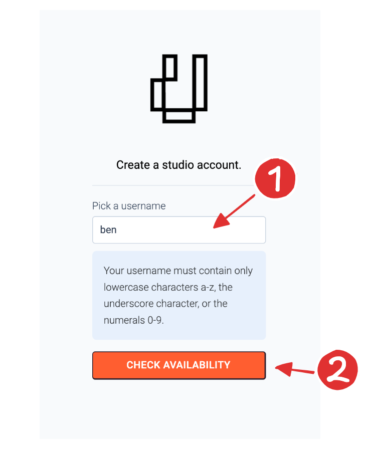
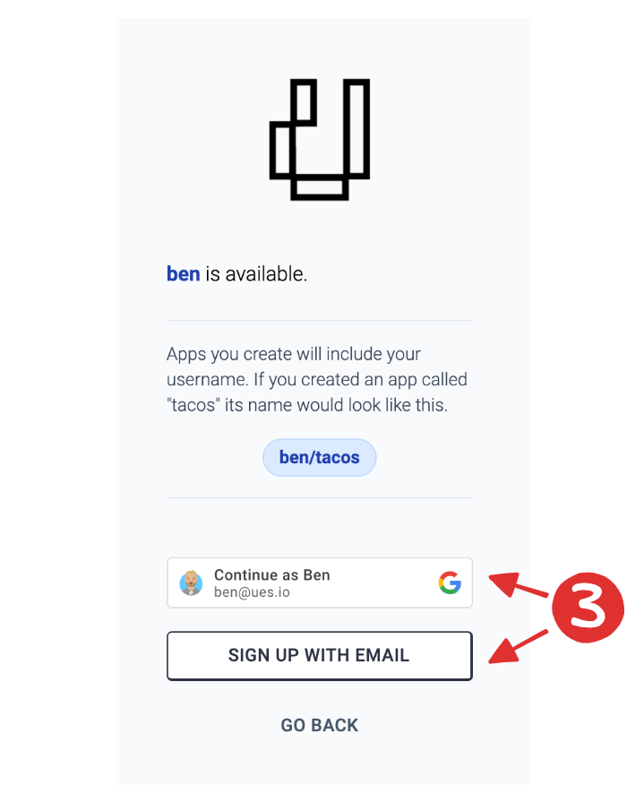
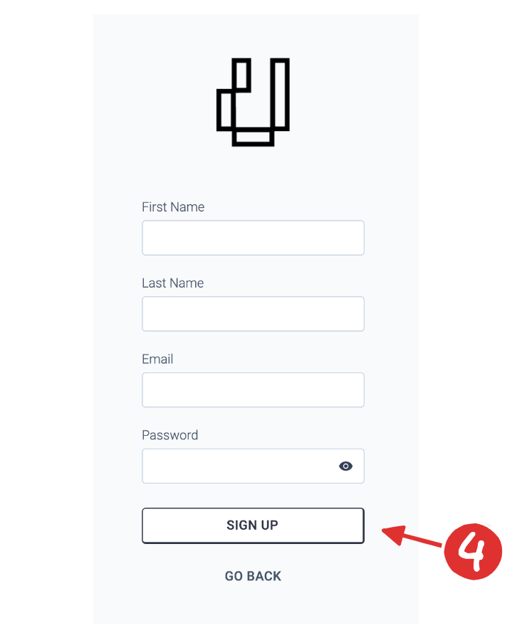
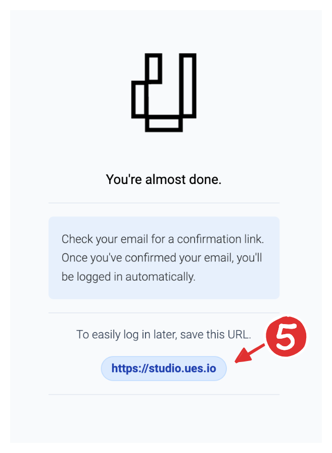

To sign up for access to the ues.io studio and start building apps, follow the steps below.

## Signup URL

### Go to the studio signup page. [studio.ues.io/signup](https://studio.ues.io/signup)

You can also access this page by clicking on the "Create Account" link on the studio [login](https://studio.ues.io) page.

## Pick Your Username

### 1. Select a username

The shorter this is, the better. Also, this username cannot contain spaces or any special characters. Only the lowercase characters a-z, the numbers 0-9, and the underscore character are allowed.

### 2. Check Availability

Click the "Check Availability" button to see if that username has already been taken. If it has, you will need to select a different username. If not, you'll proceed onto the next step.

## Authentication Method

### 3. Choose how we will authenticate you.

There are currently two options for how you authenticate to the studio. If you have a google account and want to authenticate with google, select that option. If you want to use your email to authenticate, select "Sign Up with Email".

## User Details

### 4. Let us know a bit about you.

We just need your name and email address to create your account. Select a password that contains an uppercase letter, a lowercase letter, a symbol and a number.

## Email Confirmation

### 5. Review your information and check your email.

You should recieve an email from us shortly. Click "Confirm Email" button in the email to finish the signup process. This screen also displays the URL you will need to log in again. This link is also in the email you received.

If you signed up with google, we don't need to confirm your email and you can skip this step. You will just recieve a welcome email instead.

## Next Steps

Congratuations. You've successfully created your ues.io studio account. You should be on the studio home screen now.

Click on the next lesson to create your [first app](first-app).
