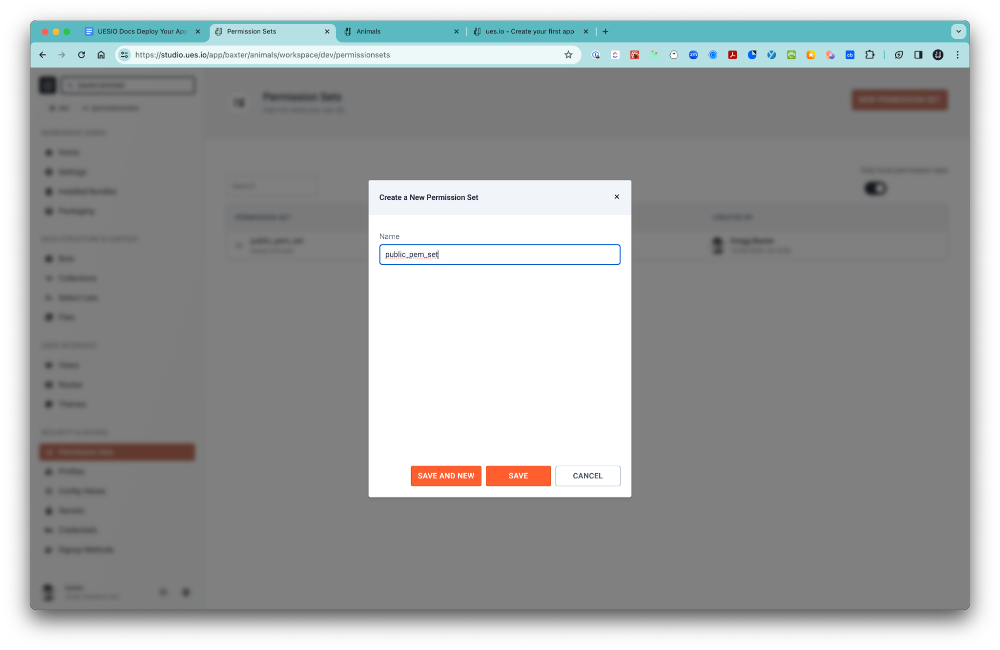
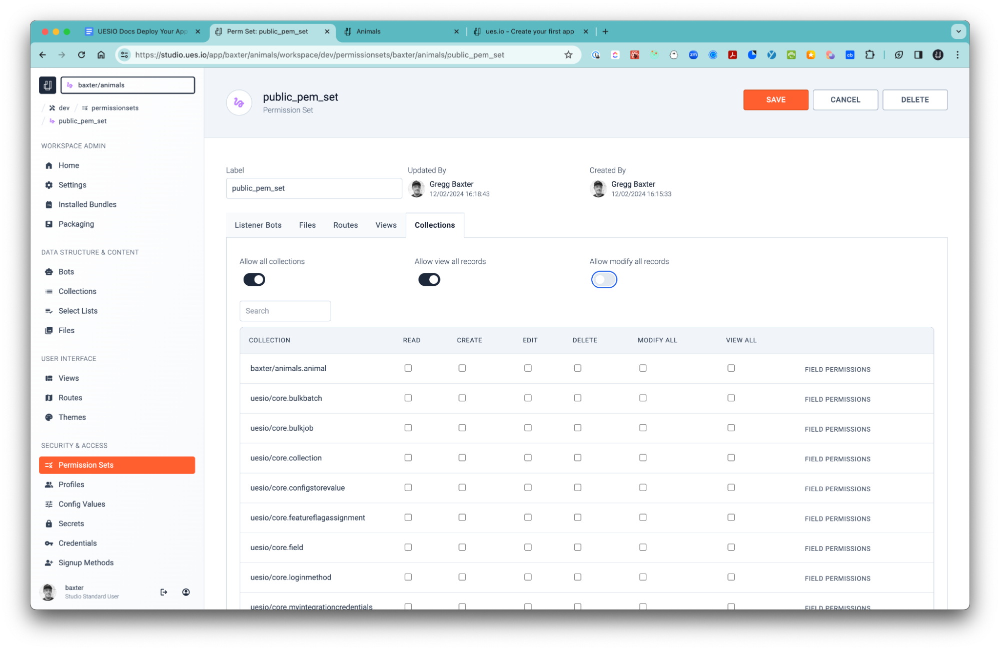
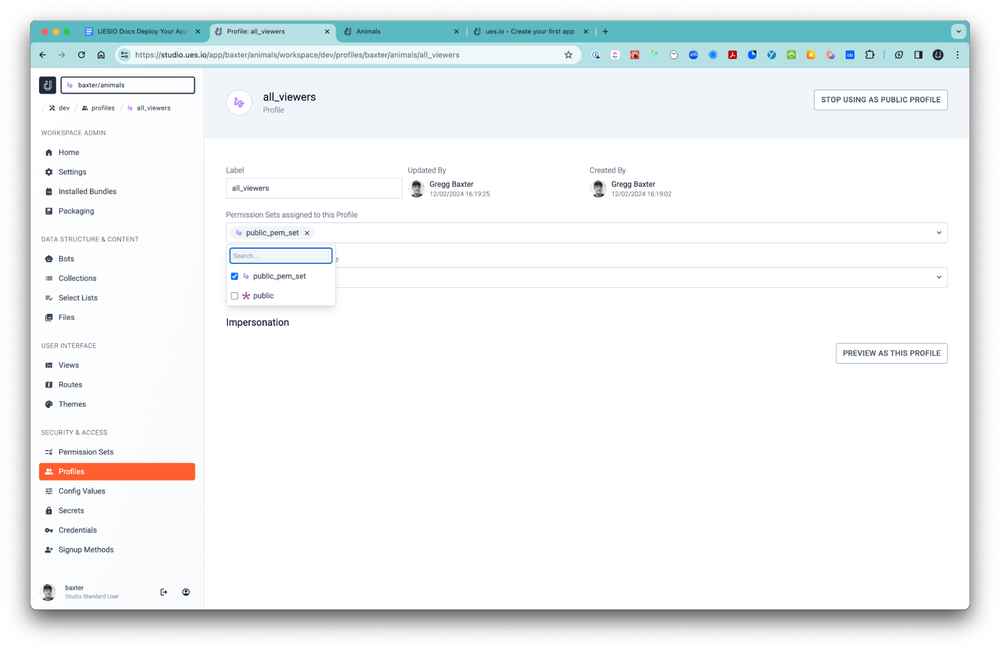
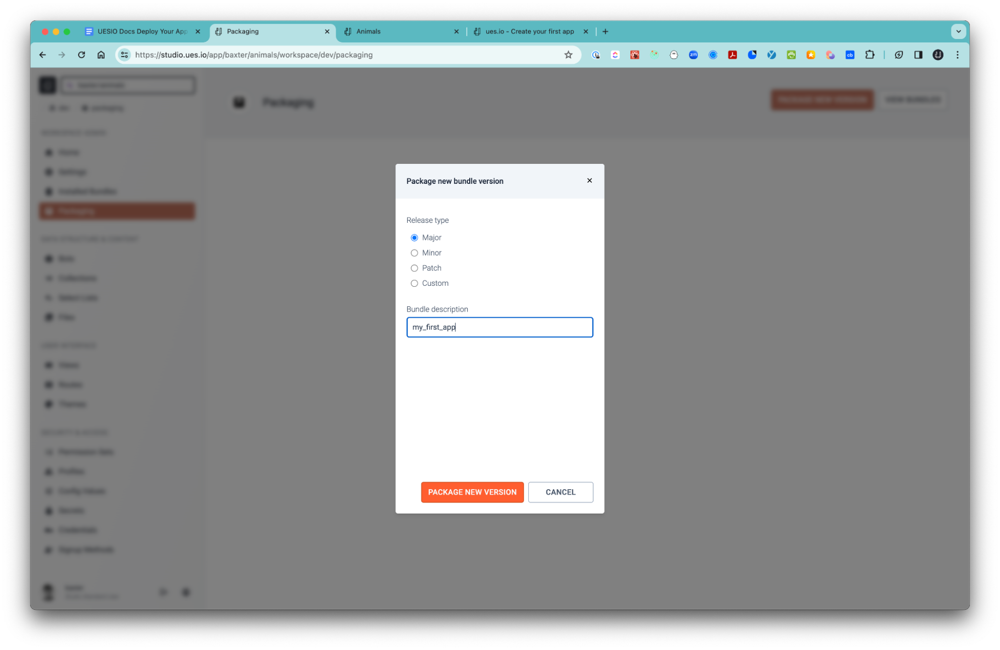
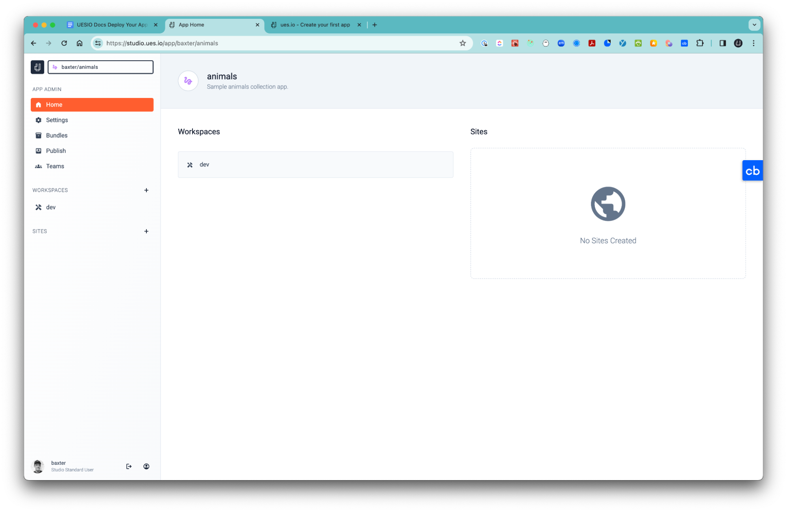
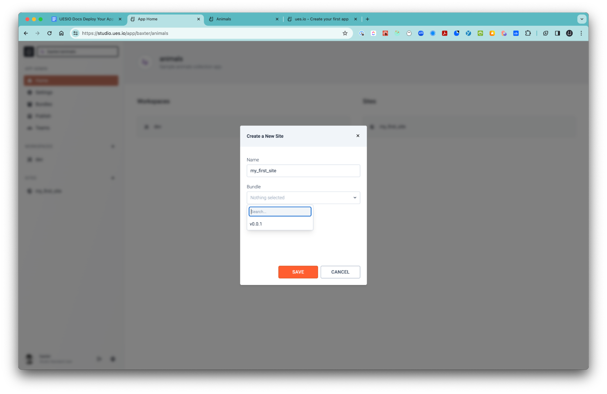
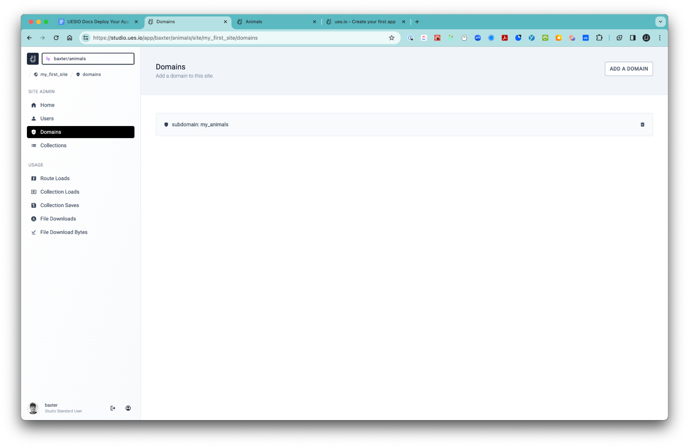
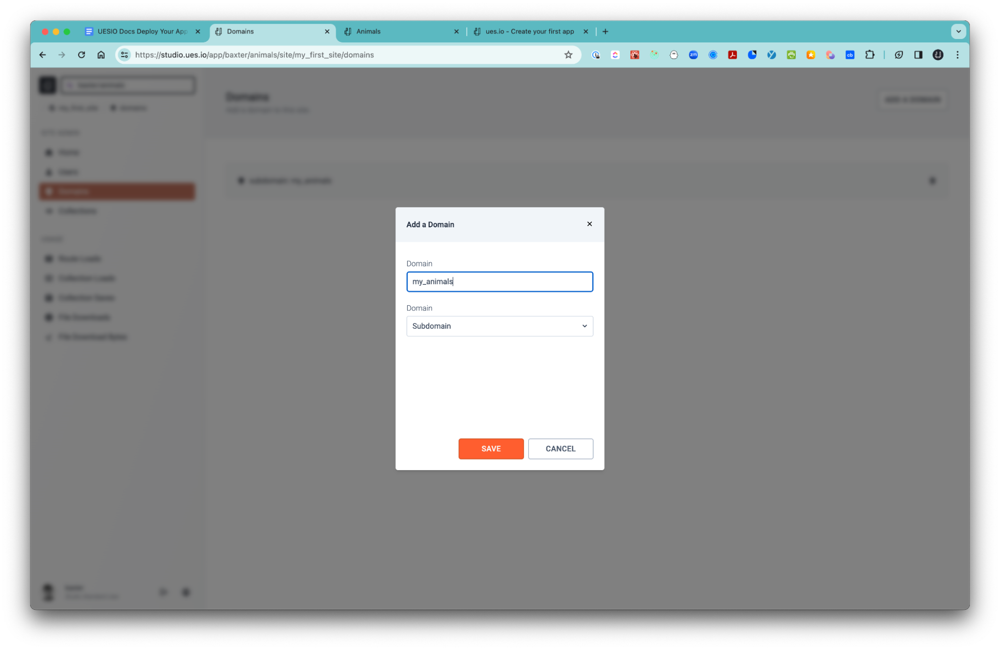
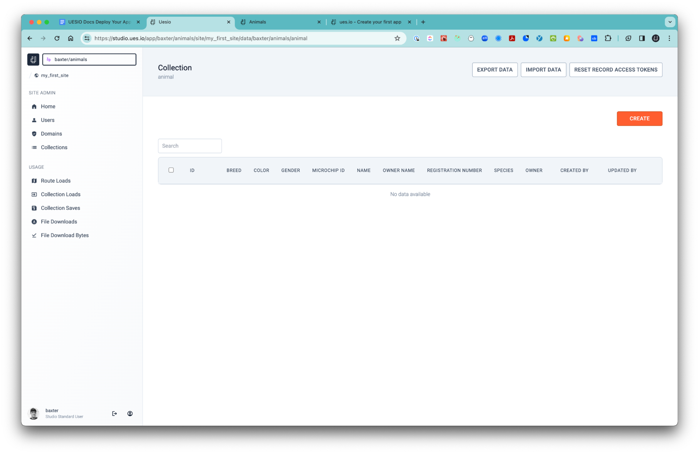
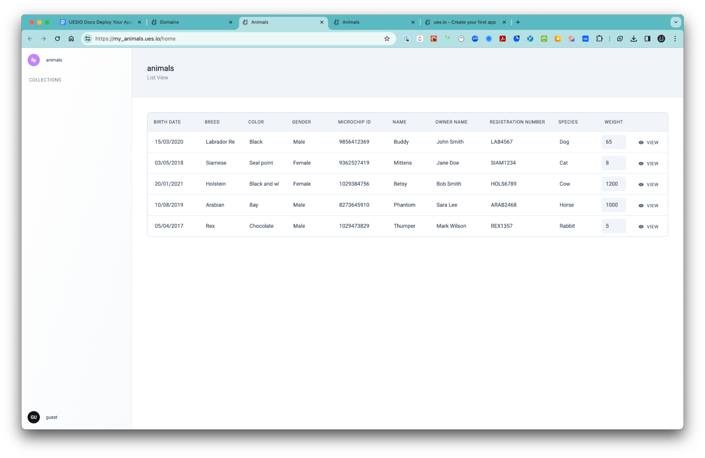

In the previous guide we went over creating your first app with Collections, Views and Routes. Our next step is to deploy what we've built to actual users. To do that we'll need to do a few things.

1. Set our landing or "home" route. This is the route that users are directed to if they just go to the base url for your site.
2. Create a Permssion Set for the public user. These permissions are given to any user who visits your site and has not logged in.
3. Create a Profile and assign a permissin set to the profile. We set the new profile as the default public profile.
4. Package your app into a bundle. This will take the current state of your workspace and turn it into a bundle that can be deployed.
5. Create a site and give it a domain. This will allow users to access your app from the ues.io domain on the subdomain you choose.
6. Add some data to your site through the studio collection admin screen.

Let's get started!

## 1. Set a home route to your app

-   In your workspace, click on the Routes navigation tile, and then click the "Edit" button.

-   Set the Home Route to the route we created. Because this will be a public facing app we won’t worry about a Login or Signup route for now but you can include those for self sign up and custom login screens.

## 2. Create a permission set

-   Click on the Permission Sets bread crumb and click on create a new permission set.

-   Click on each header and allow all access for all.

## 3. Create a profile and assign a permission set

-   Click on the Profiles bread crumb and New Profile button and call it ‘all_viewers’. Then Edit and assign the permission set we just created ‘public_pem_set’ to the profile and Save.

-   Then click on the ‘USE AS PUBLIC PROFILE’ button to let ues.io know to use it as the default public profile.

## 4. Package your application

-   Click on the ‘Packaging’ tile and ‘Package a New Version’ button.

-   We are now going to package all the metadata into a ‘bundle’ version.
-   Add a bundle description and select ‘PACKAGE NEW VERSION’.
-   You will then be navigated to this page.

## 5. Create a Site and deploy your application

-   Select the ‘+’ icon next to the ‘SITES’ tile and create a Site.

-   Give your Site a name and select the Bundle version from the drop down. If you go back to your dev environment and make changes and then Package a new Bundle version then you can edit your Site and roll forward to the latest or roll back to a previous version/s.
-   You will then be navigated to the next page that looks like this.

Create a Domain & Subdomain

-   Click on the button ‘ADD A DOMAIN’.
-   Give your domain a name and leave the Domain type as Subdomain. This can be used to redirect your home route to your registered domain if you have one.

## 6. Add data to your live collection

-   Click on the ‘Collections’ tile and then select ‘Details’ next to the ‘animals’ collection we created.

-   From here you can either manually create data or import data from a CSV file matching the headings of the fields we chose to create. You can also export your data from here if you need as well as reset record access tokens.

-   Here we can simply add a few records for demonstration purposes.

-   After we have added some data we can return to the ‘Domains’ tile and click on the Site we created and you will now see your app live.

