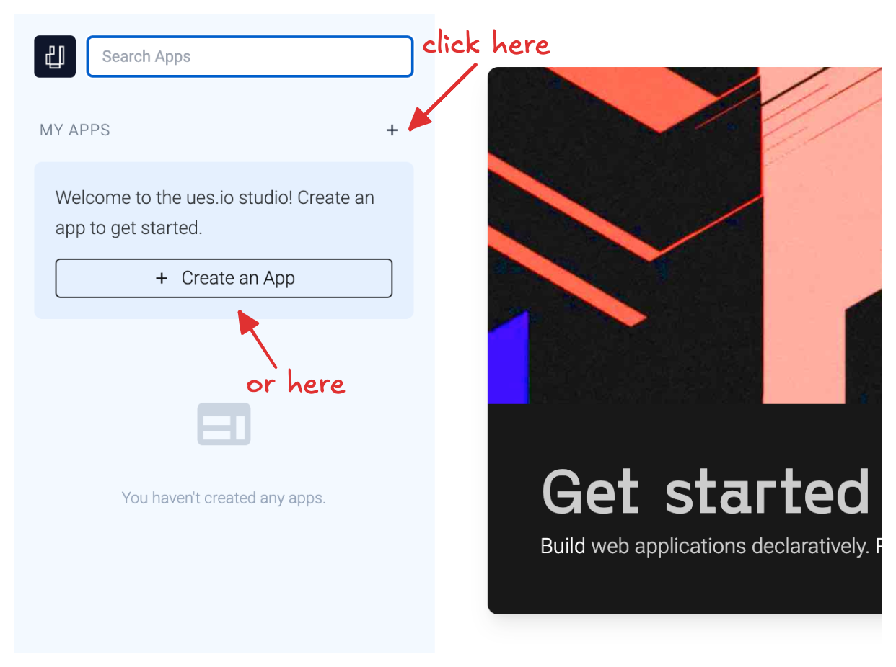
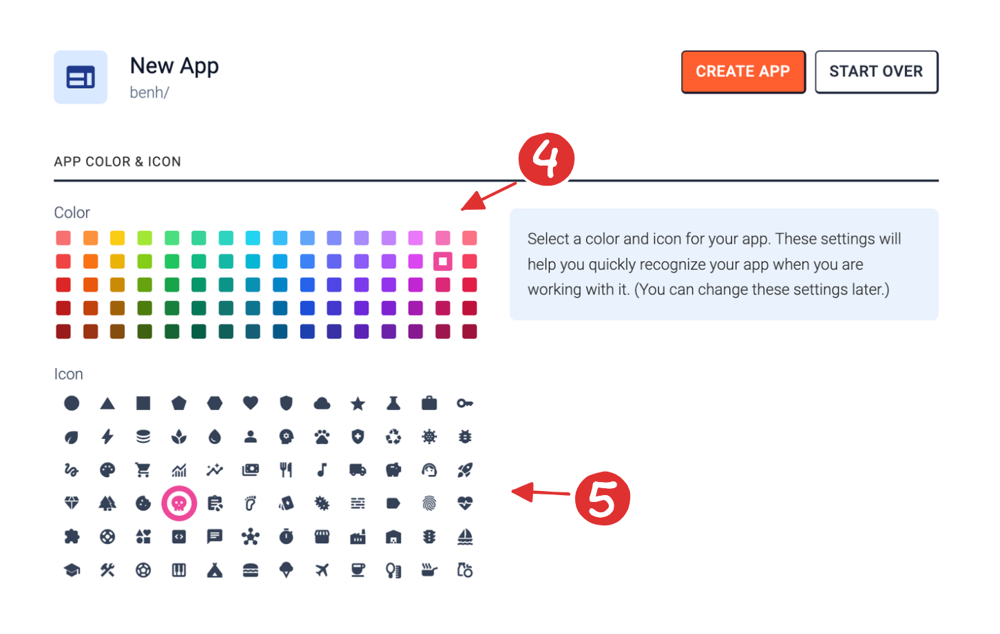
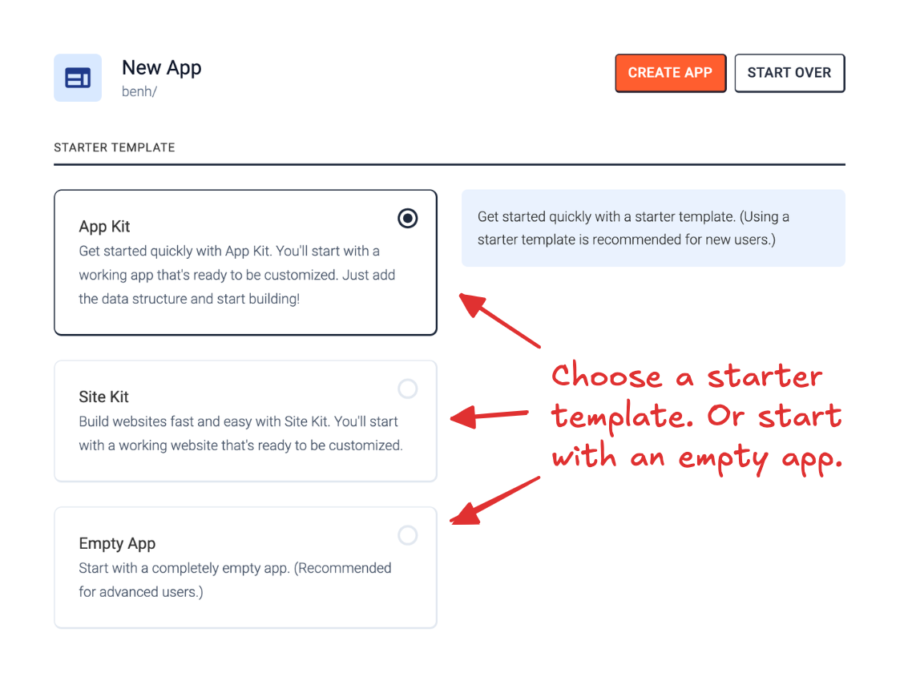

Now that you're logged in to ues.io, it's time to create your first app!

First, let's talk about we mean by "app".

## What are Apps?

In ues.io, an App is a bundle of metadata items. An App could have a few metadata items, e.g. a custom component that you've created and want to share with other ues.io builders, or an App could have a lot of items that comprise what we traditionally think of as an "application", e.g. a recruiting management application or an employee portal, which each might have various [collections](collections), [views](views), [routes](routes), and other metadata items (which we'll discuss soon).

Each user (or organization) can create or own one or more apps. Apps are referred to by the combination of their name and the name of the user/orgnaization who owns the app, e.g. `anna/restaurant-management`, `jose/animal-finder`. This combination of user and app name is also sometimes referred to as a `namespace`.

At this point, you've already interacted with 4 different apps owned by the uesio organization:

-   `uesio/web` (ues.io's main web site)
-   `uesio/docs` (where you are right now)
-   `uesio/studio` (the app for building apps, which you are logged in to right now)
-   `uesio/io` (a pre-installed collection of components used by most apps)

## Create an App

Before we move on, go ahead and create your first app by clicking the + button in the top left of the sidebar. If you haven't created any other apps yet, there will also be a larger button directing you to create an app.

### 1. Pick your app's name and owner.

Think of a name for your app. It's best practice to keep your app names as short as possible. For example, if you were creating a Customer Relationship Management app, just call the app `crm`. App names cannot contain spaces or any special characters. Only the lowercase characters a-z, the numbers 0-9, and the underscore character are allowed.

### 2. Give your app a description.

The description of your app is not required and can be changed at any time (unlike your app's name). Feel free to leave this blank or put in a brief description of your app. If you plan to use any of the AI App generation tools, this description can be useful for helping AI models determine the kind of app you want to create.

### 3. Set the owner field.

If you're just getting started, you can just leave the owner of your app as the default (you). If you're doing work on behalf of an organization, you would select your organization here instead of yourself.

### 4. and 5. Give your app a color and icon.

Since ues.io allows apps to inherit functionality from other apps, it's nice to have a quick way to recognize an app at a glance. Just pick a color and icon that feels right. (Don't agonize over it too much, you can always change these at any time.)

In the next section of the app creation process, we can select a starting point for our app.

## Starter Templates

The ues.io platform allows apps to package special scripts that allow for quickly generating configuration in apps that have them installed. In ues.io terms, these special scripts are called `Generator Bots`. Generator bots that can be run as a starting point for a new app are called `Starter Templates`. App Kit and Site Kit are two apps that have Starter Templates to help you get started or an project quickly.

Use the App Kit starter template if you plan on creating an app for authenticated users who will primarily be doing Create, Read, Update, Delete operations on your data. App Kit has all the tools you need for making an internal admin panel or customer portal.

Use the Site Kit starter template if your primary use case is a website for public consumption. Site Kit has tools for making great looking, responsive websites in ues.io.

If your app will have aspects of both an internal admin panel and a public website, don't worry, you can use both of these packages in conjunction with eachother, but you will need to use one as a starting point.

The Empty App option is for advanced users who want to start with a blank slate.

For the purposes of this guide, just select the App Kit starter template and go on to the starter template options section.

### Starter Template Options

This section is different depending on which starter template you choose. For now, just leave these options in their default state, and click the "Create App" button.

## Next Steps

Congratulations! You've created your first ues.io application. Click the next guide to learn about making changes to your app in Workspaces.
