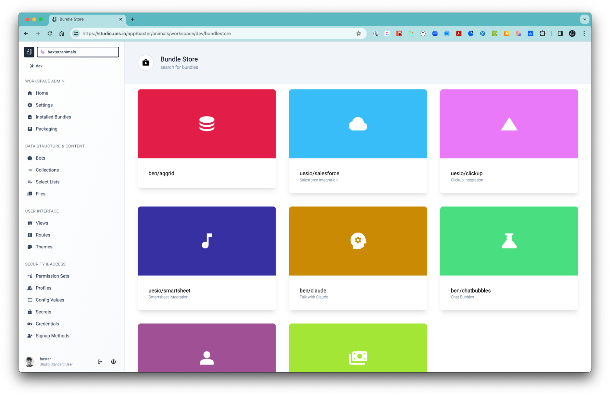
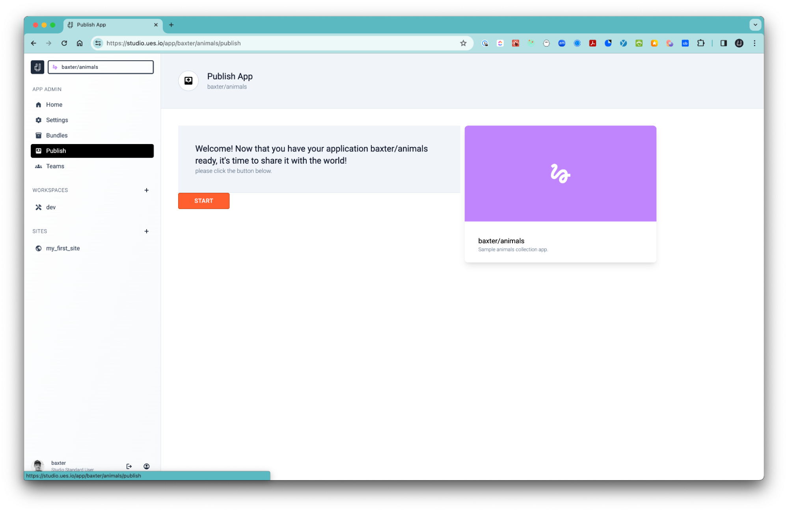
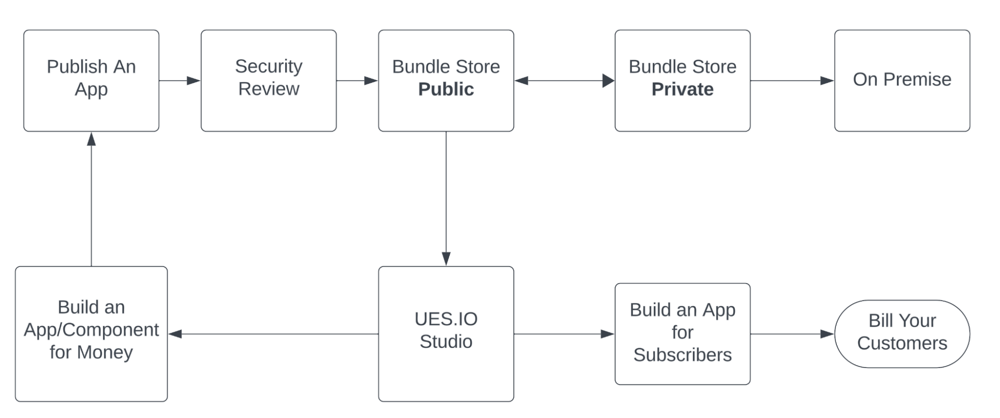

# The Bundle Store

Because we chose managed packages as part of our architecture when we built ues.io our users can install bundled applications or components from our public Bundle Store to their [Workspaces](workspaces) and then customize or include them in their own applications that they are building.

The bundles could be complete working applications or any parts that make up a complete application like tables or designs and more. This gives our users extreme abilities to extend and enrich their applications and shortening their development cycles. An example, if you build a simple accounting application and you need an inventory management application you could head over to the Bundle Store and install an inventory management application and it would be available in your Workspace where you can customize your application to include it and then package your application, including the bundle you installed, as a single application.

-   To access the Bundle Store you need to be in your Workspace and select the ‘Installed Bundles’ breadcrumb and then the ‘BROWSE BUNDLE STORE’ button. To install a bundle click on the one you want to install and click on the ‘INSTALL’ button, return to your Workcase ‘Installed Bundles’ breadcrumb and you will see it there.

1. Managed Packages
2. Publish a Bundle Store Application
3. Security
4. Public vs. Private Bundle Stores
5. Publish a Self-Signup Application
6. Logigram

## 1. Managed Packages

-   Managed packages are sets of metadata and code that developers create to distribute functionality on the ues.io platform. They are created by ISVs (Independent Software Vendors) to offer their applications to customers.
-   A managed package typically consists of various components such as custom collections, fields, bot workflows and everything that makes up the application built in your Workspace. These components are packaged together to deliver a specific set of features and functionality. Managed packages follow a versioning system.
-   Each release of a managed package is assigned a version number. Customers can choose to install or upgrade to specific versions of the package based on their requirements. Versioning ensures consistency and allows for backward compatibility.
-   Managed packages provide a level of security by encapsulating their functionality and preventing direct access to their code. Customers can only interact with the packaged functionality through defined interfaces and APIs, which helps in maintaining data integrity and security.
-   ISVs can control access to their managed packages through licensing and permissions. They can define different types of licenses (e.g., user-based, feature-based) and set permissions to restrict access to certain features or functionality based on the customer's subscription level.
-   Managed packages support upgrades and patching mechanisms. ISVs can release updates to their packages to introduce new features, bug fixes, or security patches. Customers can then choose to upgrade to the latest version of the package to benefit from these enhancements.

## 2. Publish a Bundle Store Application

-   When you have built and packaged your application bundle you can publish it to the Bundle Store for others to install into their Workspaces and use. You can set a charge for your App Bundle that will be charged to the user when they connect your App Bundle to their Site for usage. The author of the Bundle will not be charged for your usage but will only receive the prescribed amount for the Bundle that they set when you installed the Bundle as an author credit. Follow these steps to publish your Bundle to the Bundle Store.
-   By now you have built something in your Workspace and packaged a new version of your work.
-   Head to your App Admin section and select the ‘Publish’ breadcrumb.
-   You can select the ‘START’ button which will only show up if you have packaged your application.
-   Be sure to make sure you do a full end to end test of your application and you don’t have any malicious code or else it will NOT get listed.

## 3. Security

-   We take security very seriously and we do a full audit of all the code that gets submitted for publishing in the Bundle Store. Our [Terms of Use](https://ues.io/terms) clearly hold the publisher liable for any damages or legal contraventions should they attempt to submit code out of our set boundaries.
-   Depending on the complexity of the Bundle submitted for publishing will depend on the speed at which it will be published should it pass security. Generally we like to under promise than over promise but we do our best to have the code reviewed within 5 working days or sooner.
-   Once your application has passed and listed in the Bundle Store you will receive an email confirming its release and it will be available for all ues.io users in the Bundle Store.

## 4. Public vs. Private Bundle Stores

-   Because ues.io is built to be run on-premise, in other words running on a local server and behind a virtual private network (VPN), the user will have a Private Bundle Store and no access to the ues.io Public Bundle Store.
-   Customers that run ues.io on-premise can determine which Bundles they would like to have listed in their Private Bundle Store.
-   The Admin user of a ues.io instance can access the Public Bundle Store and select which public bundles they would like to make available for their Studio users in their Private Bundle Store.

## 5. Publish a Self-Signup Application

-   If you would like to publish an application as an independent publisher you can build your turnkey solution and publish it from a Site that you choose in ues.io as the end URL.
-   You can set up login and self-signup screens where your target users can self register and subscribe to your application and associated subscription tiers. There is a Stripe Bundle that can be accessed from the Bundle Store and used to set up billing.

## 6. Logigram

-   Below is a diagram of the current logic behind the Bundle Store.

