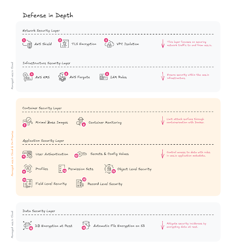

## A Layered Approach

At ues.io we employ a layered approach to security. This ensures that multiple, overlapping controls at each layer protect your application. The layers we will detail are the network layer, the infrastructure layer, the container layer, the application layer, and finally, the data layer. This can also be thought of as a _Defense in Depth_. (Shown in the diagram on the next page.) Each security feature is described in detail on the following pages.

NOTE: For ues.io cloud customers, all of these layers are applicable to their implementation. For ues.io on-premise customers, only the container and application layers are relevant.

## Network Security Layer

This layer secures the network traffic to and from your ues.io applications. It ensures protection from a variety of risks such as DDoS and Man-in-the-Middle attacks. We make every effort to reduce the attack surface area by employing sophisticated network security tools. On this layer, we rely primarily on the security features of the underlying platform. (In this case AWS)

1. **AWS Shield** \- To automatically detect and mitigate sophisticated network-level distributed denial of service (DDoS) events, ues.io makes use of AWS Shield. This will also protect applications and APIs from SYN floods, UDP floods, or other reflection attacks. We also have the ability to deploy inline mitigations such as deterministic packet filtering and priority-based traffic shaping to stop basic network-layer attacks as necessary.

2. **TLS Encryption** \- ues.io uses AWS Application Load Balancers to terminate SSL and perform the work of encrypting and decrypting network traffic. All traffic is encrypted using TLS 1.3.

3. **VPC Isolation** \- All services are isolated within an AWS VPC using private subnets for ECS tasks and containers, restricting direct internet access. Public subnets are only configured for external facing load balancers.

## Infrastructure Security Layer

For our cloud deployment of ues.io, we use the AWS Elastic Container Service to handle our container orchestration. It helps us easily deploy, manage, and scale our platform. This way, we can focus on building the applications, not the environment. Our ECS tasks are configured with read-only file systems and non-root users to limit container privileges.

1. **AWS KMS** \- AWS Secrets Manager allows us to centrally store and manage credentials, API keys, and other secrets. AWS KMS is used for storing and managing our data encryption keys.

2. **AWS Fargate** \- AWS Fargate is used for serverless container hosting to reduce the attack surface, as AWS manages the underlying infrastructure. This prevents the need to perform software updates and security patches or perform other administrative tasks on individual servers.

3. **IAM Rules** \- Roles to ECS tasks (via task roles) and ECS instances (for EC2 launch type) are assigned based on the principle of least privilege. For example, ECS tasks are only granted the permissions needed to access specific S3 buckets or databases.

## Container Security Layer

This layer includes the security features baked into our containers themselves. The ues.io application is distributed as a Docker container. These containers run as separate processes, limiting the potential impact of a breach. If one container is compromised, it's harder for an attacker to affect others or the host system. Docker's isolation also helps to protect against denial-of-service attacks, as resource quotas can be set to limit a container's CPU and memory usage.

1. **Minimal Base Images** \- ues.io makes use of the Alpine Linux distro for its base container image. Smaller base images with less features mean less attack vectors. By using a minimal base image we get several benefits, primarily related to security, size, and performance. Alpine's small size (around 5MB) leads to faster downloads, quicker deployments, and reduced resource consumption.

2. **Container Monitoring** \- By using Docker containers, standard services for logging and monitoring can be used. For our managed cloud offering of ues.io, we use Amazon CloudWatch Container Insights to monitor container health and detect anomalies. It is integrated with AWS Security Hub for centralized security findings.

## Application Security Layer

While the other security layers are common in many applications, the Application Security Layer is specific to the ues.io platform. Each ues.io tenant (or site) has its own set of users and isolated data. Data from one tenant is inaccessible to other tenants through our Application Security Layer. This layer is also responsible for applying the business rules specific to your application for limiting access to data to certain users. With ues.io you can create and modify these rules through our intuitive, declarative security abstractions. These are _Profiles_, _Permission Sets_, _User Access Tokens_, and _Record Access Tokens_.

1. **User Authentication** \- Incoming traffic is matched to a site using the domain or subdomain provided in the request url. Once the site is determined, users can authenticate using one of the following authentication mechanisms.

    1. **Username/Password** \- Only salted password hashes (created with bcrypt) are stored. Users must provide a valid email address for this authentication method in order to facilitate password resets.

    2. **External Identity Providers** \- Currently only Google Authentication is supported, but other providers can be added on request.

    3. **SAML 2.0** \- Tested on services like Auth0 and Amazon Federated Identity.

    Once the user is authenticated, they are given a cryptographically secure, random session id that is stored in a secure (https-only) cookie.

2. **Secrets & Config Values** \- Every application needs multiple environments to facilitate use cases like development, testing and production. Secrets and Config Values allow for securely storing api keys, secrets and configuration specific to each environment.

3. **Profiles** \- Every ues.io user has one and only one profile. This corresponds to their role in the application. Profiles are a way of connecting multiple permission sets to a particular user.

4. **Permission Sets** \- Permission Sets grant access to ues.io resources. These rules are configured in the ues.io Studio when developing applications. They can grant access to other metadata items such as _Bots_, _Files_, _Collections_, _Fields_, _Views_ and _Routes_.

5. **Object Level Security** \- Application developers can give some users access to certain collections while denying them access to others. Granular permissions such as create, read, update, and delete can be configured per collection. This is configured in the ues.io Studio under _Permission Sets_.

6. **Field Level Security** \- Along with security controls on the collections, ues.io developers can provide rules for read and write permissions on individual fields. This is also configured in the ues.io Studio under _Permission Sets_.

7. **Record Level Security** \- ues.io provides a robust framework for managing record level security. Collections can be marked as _open_ (no record-level security) or _protected_. Records in protected collections can only be accessed if the user gains access through some other mechanism. This can be accomplished through the ownership model, or by using _Record Access Tokens_, _User Access Tokens_ and _Access Fields_.

    1. **Ownership Model** \- Each record in ues.io has an _owner_. This starts out as the user who created the record, but can be changed to another user by any user that has write access to that record and field-level access to the owner field of that collection. The owner of a record always has record-level access to it.

    2. **Record Access Tokens** \- _Record Access Tokens_ give access based on the data in record. For example, _Record Access Tokens_ could allow a record with an _isPublished_ field to be accessible to everyone when it is set to true, but not when the _isPublished_ field was set to false.

    3. **User Access Tokens** \- User Access Tokens give access to a record based on some attribute of the user, or data related to the user. For example, a user could get access to records associated with a particular “team” collection, if that user was also associated with that “team” collection. The combination of _User Access Tokens_, and _Record Access Tokens_ allows for arbitrarily complex access rules to be created and enforced declaratively.

    4. **Access Fields** \- Sometimes you want to grant access to a record dependent on the access rules of its parent. By specifying an Access Field on a collection, you transfer the responsibility of record-level security to a record pointed at by a reference field. For example, a _Chat Item_’s record-level security could be determined by the record-level security of its parent _Chat Thread_ record.

## Data Security Layer

All ues.io data that uses our built-in data store and file store are encrypted at rest. Even if an attacker somehow managed to bypass the application layer, they would not be able to read any data without encryption keys stored in AWS’s secure key store, KMS.

1. **DB Encryption at Rest** \- For ues.io managed cloud deployments, we use an Amazon Aurora encrypted DB cluster. It uses the industry standard AES-256 encryption algorithm to encrypt your data. Amazon Aurora handles authentication of access and decryption of your data transparently with a minimal impact on performance.

2. **Automatic File Encryption on S3** \- All Amazon S3 buckets have encryption configured by default, and all new objects that are uploaded to an S3 bucket are automatically encrypted at rest. Server-side encryption with Amazon S3 managed keys (SSE-S3) is the default encryption configuration for every bucket in Amazon S3.

## Immutable Bundles

Unlike other popular platforms where changes can be made to production without a formalized process, ues.io creates immutable bundles with every deployment. This has several advantages.

1. **Less User Error** \- Since development environments are completely isolated from production, users cannot inadvertently make changes to production.

2. **Formalized Change Management Process** \- Every change to production will be part of a bundle deployment. This process can be formalized and restricted using git and the ues.io CLI.

3. **Instantaneous Rollbacks** \- Everyone makes mistakes. With ues.io, deployments can be rolled back to a previous version with a click of a button.

4. **Aggressive Caching** \- Because ues.io application bundles are immutable, they can be aggressively cached without any downsides. This improves the performance and costs associated with your apps.

## Security through Standardization

Because of ues.io’s built-in multi-tenancy features, you can run many apps on one ues.io instance. In fact, you can run _all_ your apps on ues.io. By migrating legacy applications to ues.io you can gain an advantage with standardization. Instead of monitoring, certifying, and training on 100s of microservices, you can focus on one ues.io instance for your organization.

## Compliance and Standards

Compliance with regulatory requirements and industry standards is a critical component of ues.io’s security strategy. Operating on AWS Elastic Container Service (ECS), our platform is designed to meet stringent legal and technical obligations, ensuring the protection of user data and trust. This section outlines our adherence to key regulations, including the General Data Protection Regulation (GDPR), and our alignment with industry best practices, such as those provided by the Open Web Application Security Project (OWASP).

1. **GDPR** \- As a platform handling personal data of users, potentially including those in the European Union, ues.io complies with GDPR, a comprehensive data protection regulation enforced since May 2018\. Key GDPR compliance measures include:

    1. **Data Minimization and Purpose Limitation** \- We collect and process only the personal data necessary for specific, lawful purposes (e.g., user account management, transaction processing). Data usage is clearly communicated in our privacy policy.

    2. **User Rights** \- Users can exercise GDPR rights, including access, rectification, erasure (right to be forgotten), and data portability. Automated workflows and secure APIs enable users to submit requests, which are processed promptly.

    3. **Data Protection by Design and Default** \- Our ECS-based architecture incorporates encryption (e.g., TLS 1.3 for data in transit, AES-256 for data at rest via AWS KMS), pseudonymization where applicable, and strict access controls to safeguard personal data.

    4. **Data Breach Notification** \- In the event of a data breach, we have procedures to notify affected users and relevant authorities (e.g., EU Data Protection Authorities) within 72 hours, as required by GDPR Article 33\. These are supported by AWS Security Hub and CloudWatch for rapid detection.

2. **OWASP** \- The Open Web Application Security Project provides a globally recognized framework for securing web applications. ues.io aligns with OWASP guidelines to mitigate common vulnerabilities and enhance application security.

    1. **OWASP Top 10 Mitigation** \- Our development and security teams prioritize protections against the OWASP Top 10 vulnerabilities, including injection attacks (e.g., SQL injection), broken authentication, and cross-site scripting (XSS). For example, we implement input validation, parameterized queries, and output encoding in all ECS-hosted application code.

    2. **Secure Development Lifecycle** \- OWASP’s Software Assurance Maturity Model (SAMM) informs our secure coding practices. We employ sophisticated static analysis tools such as type checkers, compilers, and linters in our continuous integration process.

    3. **API Security** \- Public-facing APIs follow OWASP API Security Top 10 guidelines, incorporating session-based authentication and protection against excessive data exposure.

## Dependency Management

1. **Github Dependabot** \- We use github’s built-in dependency management bot to ensure that our dependencies are up-to-date with the latest security updates.

2. **npm audit** \- All of the dependencies included in ues.io are submitted to the default registry and asked for a report of known vulnerabilities.

## Automated Security Checks

We utilize GitGuardian to automatically check every commit to our application code. GitGuardian is a code security platform that focuses on secrets detection and remediation in software development pipelines. It helps developers, security teams, and operations professionals prevent secrets leaks by scanning code, version control systems, and CI/CD pipelines.

## Automated Testing

Unit, integration, and end-to-end testing ensure against security regressions. These tests are run after every code change and are required to pass on all deployments.

## Maintenance and Updates

All ues.io source code is open source and released under the permissive MIT License. It is maintained by ues.io developers, but contributions from the broader ues.io community are accepted. To view the source code and developer documentation, visit [https://github.com/ues-io/uesio](https://github.com/ues-io/uesio).

In the event of a critical security issue, a security patch can be deployed to production within minutes of completion, manual and automated testing and approval. On-premise subscribers will be notified of patches and can update their instances on their own schedule.

Incident Response Plan

As mentioned above in the GDPR section, in the event of a data breach, we have procedures to notify affected users and relevant authorities (e.g., EU Data Protection Authorities) within 72 hours, as required by GDPR Article 33\. These are supported by AWS Security Hub and CloudWatch for rapid detection.