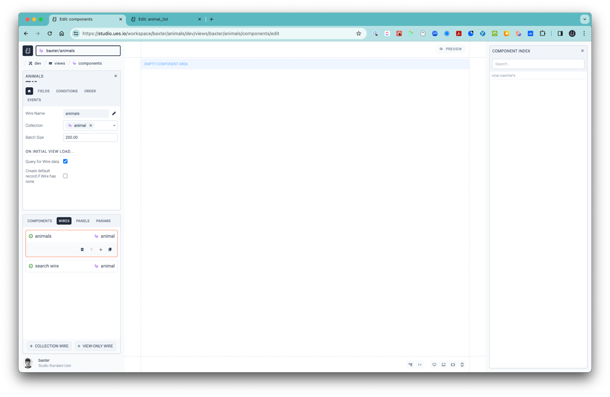
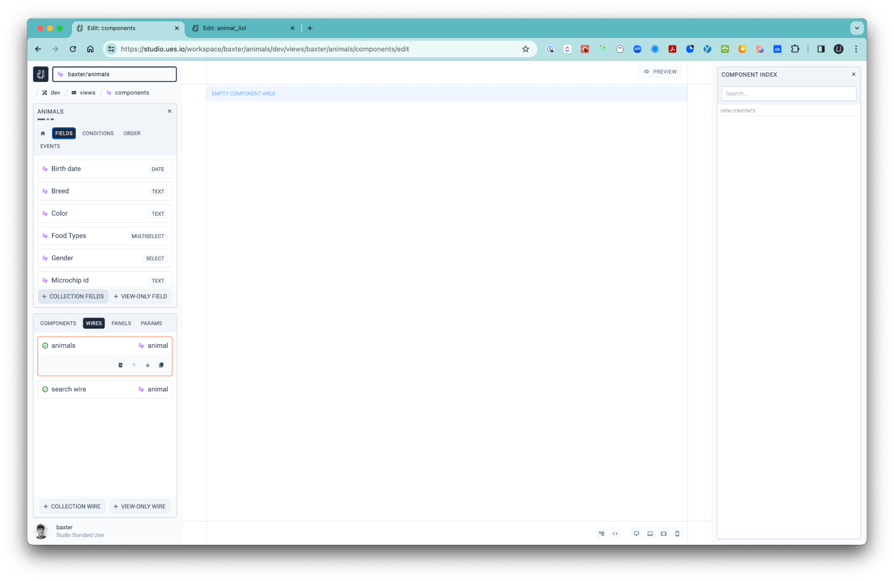
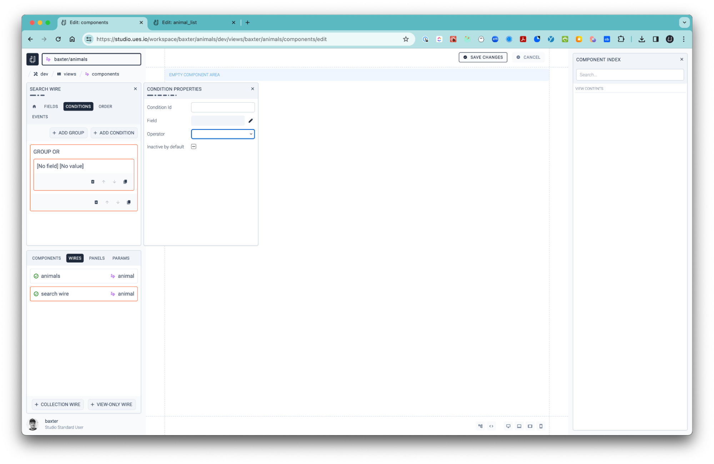
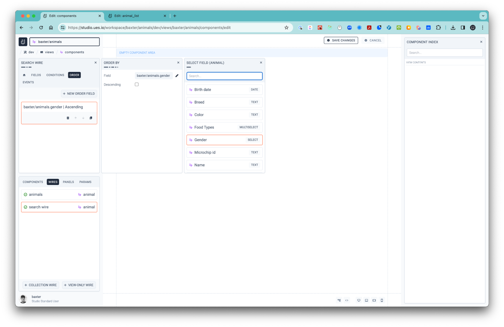
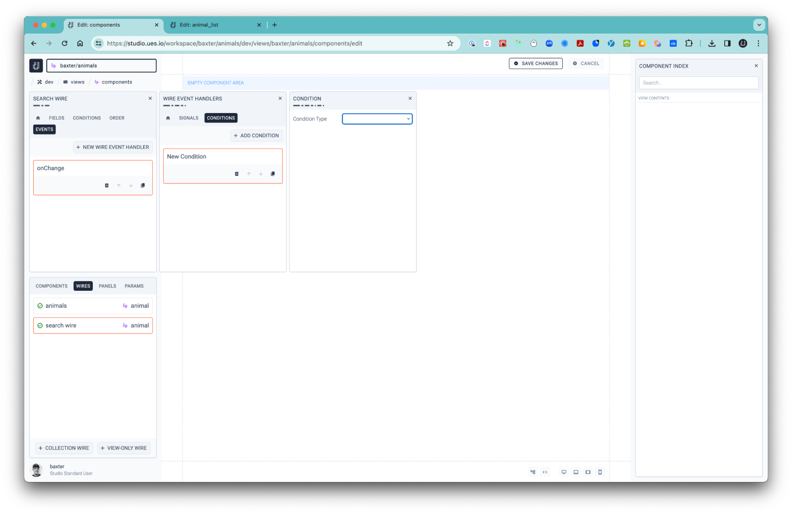

If you think about Wires you think about electricity, that’s what Wires do to the Studio View Builder experience. Wires are used to connect to your data Collections and can be referenced and used to interact with and control how data is displayed in the View. You can use many Wires in the Studio View Builder connected to a single or many data sources. You may want to use a wire just for search functionality so that it does not disturb the views of any tables or lists that are connected to the same Wire as an example. Think of a Wire as a transport path for data that can be configured to do things a Collection of data would not do as it would affect all users of the same data while working with it.

1. Creating a Wire
2. Working with Fields
3. Conditions
4. Order
5. Events
6. View Only Wires

## 1. Creating a Wire

-   Head over to the Studio View Builder and the ‘Wires’ tab next to ‘Components’ and select the ‘+ COLLECTION WIRE’ button.
-   Give your Wire a name by selecting the pencil icon and calling it say ‘search wire’ and select the check icon to save the name.
-   Choose the Collection that it should connect to, in this case animals.
-   Set the ‘Batch Size’ to as many records you would like to load on first load.
-   The ‘Query for Wire data will be selected by default. If you want to, you can deselect it and select the ‘Create default record if the Wire has None’ checkbox and the system will create a record when the component connected to the wire is loaded. This is handy for a user whose intention is to start creating records without having to press the ‘CREATE’ button when they first enter a View
-   Select the ‘SAVE’ button.

## 2. Working with Fields

-   Select the ‘FIELDS’ tab above the ‘Wire Name’ field.

-   Select the ‘+ COLLECTION FIELDS’ button and you will then be able to select the fields that should be loaded through the Wire.

## 3. Conditions

-   Select the ‘CONDITIONS’ tab.
-   Here you can create either a single condition or a group of conditions. You may want to create a condition that filters the data for say just female animals or you may want to use a group to filter for just female animals that are also cats.

## 4. Order

-   Select the ‘ORDER’ tab.
-   You can set the order by a specific field either ascending or descending.

## 5. Events

-   You can set an on change event handler that can be triggered to fire off a Signal when a field has been changed, a Wire is loaded successfully or with errors, a Wire is saved successfully or with errors or a Wires changes are canceled.
-   You can also set further conditions for Wires, Params, Merges and a few more finer values under the ‘CONDITIONS’ tab.

## 6. View Only Wires

-   These kinds of Wires only exist when the browser is loaded. Think of them as temporary databases that come to life in the View. They are great for shopping carts and items you want to work to use to store values temporarily without affecting the live data.
-   The View Only Wire defaults to ‘Create a Record if the Wire has None’ but you can also use Signals to populate the values of the first record if needed.
