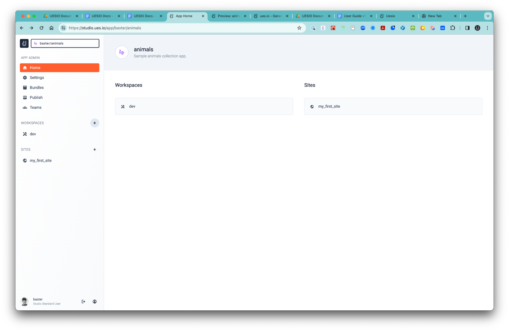
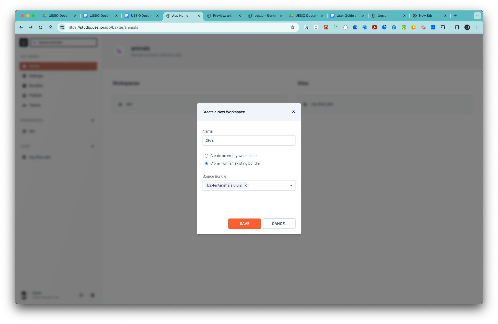
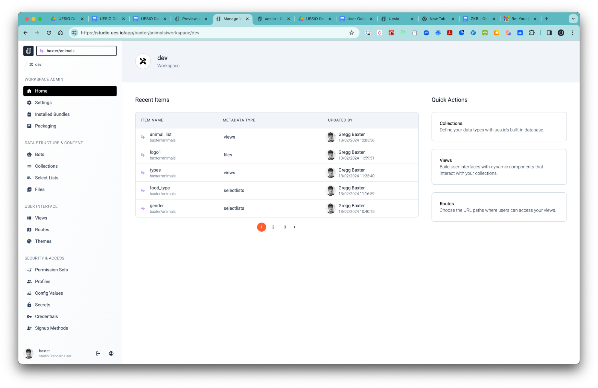
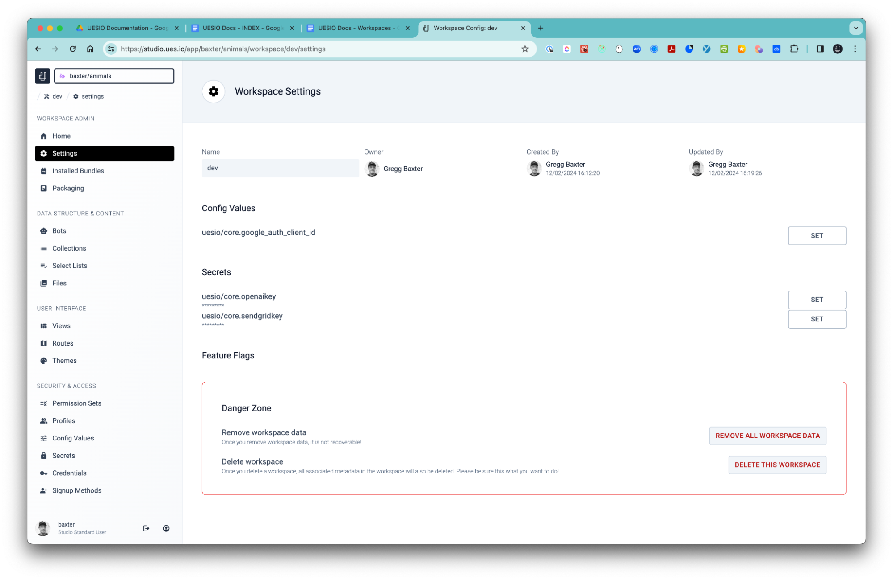

# WORKSPACES.

You can create and define your apps Data, User Interface and Administer security in a workspace. You can create as many workspaces as you need. See them as separate rooms you or a team member can work in or as branches for source control. It is good practice to use a source control tool like GitHub and keep one workspace as the source of truth and merge changes into that workspace from other workspaces in the form of branches.

When you are finished working on your app you can package a new bundle version for a 1-click deployment to your site.

#### We will walk through the following basics:

1. Create a Workspace
2. Workspace Admin
3. Data Structure & Content
4. User Interface
5. Security & Access
6. Internationalization

## 1. Create a Workspace

-   To create a Workspace click on the ‘+’ adjacent to the ‘WORKSPACE’ breadcrumb.  
    Name your workspace dev or UX or whatever describes your space.

-   When you create your workspace you can either start with a clean slate or you can choose to start with a prepackaged app in the form of a ‘Bundle’. Depending on which workspace this bundle was created from will determine what is created in the new workspace as it will transfer the exact configurations that were last made from the originating workspace.

## 2. WORKSPACE ADMIN

-   Home  
    A list of Recent Items that you worked on and a set of Quick Actions on the right hand side. You can select one and dive right into where you last left off or quickly move to your favorite controls.

-   Settings  
    An area to change your Config Values and set Secrets for integrations like OpenAI or other 3rd-party connections.
    Here you can also flush your workspace data or delete the entire workspace.

-   Installed Bundles  
    This is where you can see any bundles you may have installed that could contain other apps or components that were bundled.
-   Packaging  
    Here you can package your entire workspace into a bundled version. You can then deploy your bundle to a site that you created or create a new workspace with the bundled version so that you and your teams can work together.

## 3. DATA STRUCTURE & CONTENT

-   Bots  
    See Bots as workflow processes that you create to do something when something happens. A simple example would be to tell the ues.io Bot to update a sales target reached checkbox when the sales figure matches the forecasted sales figure.
    There are 7 bots waiting to be used and bots can even call each other or fired off in the view triggered by a signal attached to a button or other components and even from a route.

-   Collections  
    A central place to manage the different tables and fields that are wired up from the Data Sources tab. Here you can add,delete and edit fields and Select Lists created in the Select Lists tab and manage your test data if needed.

-   Select Lists  
    A place where you can create select options for users to categorize their data. If you have a list with rows representing animals you can create a Select List with the name called Food Type and populate the selectable options with plants or meat etc… and then include that Select List in a table as a field in your DATA Collections section.
-   Files  
    Here can upload files that you wish to refernce from your app something like a logo or video and more.

## 4. USER INTERFACE

-   Views  
    This is where all the action happens. Here you can configure the user interface and the different components within each view as well as the wires that connect your data to the different components.

-   Routes  
    See routes as the path that the user will use to reach the Views you have created. If you create a route path called ‘planets’ and set the view to a view you created called ‘planetlists’ then the user will reach that view at ‘mysitesubdomain.ues.io/planets`. Here you can also configure which Theme to apply to the View you are publishing at the end of the Route Path.

-   Themes  
    You can set color defaults in your themes to manage brand uniformity where needed.

## 5. SECURITY & ACCESS

-   Permission Sets  
    Set access to Files, Routes and Views and then assign the named permissions set to specific profiles.

-   Profiles  
    Create Profiles and assign permission sets to each and give your app a granular level of security.

-   Config Values  
    Named values that must be configured separately in each site / workspace

-   Secrets  
    Protected values which must be set separately in each site/environment, which are only accessible to bots/integrations.

-   Credentials  
    Named groups of secrets or config values needed for accessing a resource.

-   Signup Methods  
    Enable users to sign up for your app

## 6. INTERNATIONALIZATION

-   Labels  
    Create labels that could be used on buttons or navigation that you can use in your translations to display the text in the user's local language.
-   Translations  
    Choose from up to 8 different languages to use for label translations.
