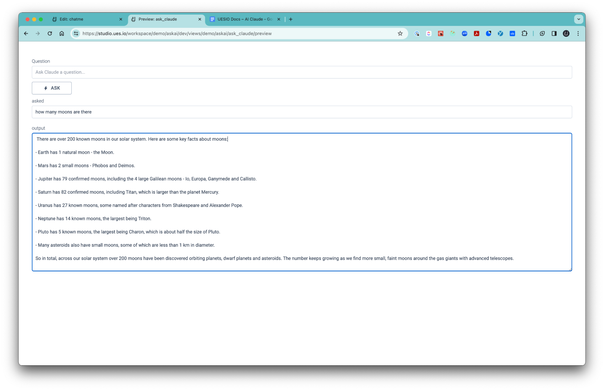

## AWS Bedrock

This is a service provided by Amazon Web Services (AWS) that allows users to access and leverage various large language models (LLMs) and other foundation models (FMs). Essentially, it's a platform that provides pre-built AI models ready for use.

## Claude

This is a specific LLM created by Anthropic, an AI safety and research company. Claude is known for being a state-of-the-art model, meaning it delivers high accuracy, performance, speed, and cost-efficiency. Businesses can use Claude through AWS Bedrock to add functionalities like text generation, question answering, and conversation creation to their applications.

# AI Claude

## How to

### 1. Install the Claude Bundle

### 2. Set up Claude in a [View](views)

### 1. Install the Claude Bundle

-   Once you have created an app and a [Workspace](workspaces) select the ‘Installed Bundles’ tile on the left and then select the ‘BROWSE BUNDLE STORE’ button.
-   Look for the Claude Integration Bundle and install it.

### 2. Set up Claude in a [View](views)

-   Next click on the [Views](views) tile and create a view
-   Select the [Wires](wires) panel and create a new view-only wire and name it inputs.
-   Select the Fields tab and create a new view-only field and name it input, type = ’text’ and Label = ’input’.
-   Create a second view-only field and name it output, type = ’Long Text’ and Label = ’output’.
-   Click on the [Components](components) tile in the View Builder and place the List component in your canvas area.
-   Select the Wire option and choose the view-only wire we created called ‘inputs’. Set the component ID =’inputList’ and the Display Mode = ‘edit’.
-   Select a Field component and place it in the List component in the canvas.
-   Set the field properties as follows: wire = ‘inputs’; field = ‘input’; label = ‘question’; set Label Position = ‘Top’; Placeholder = ‘Ask Claude a question…’; Display As = ‘Text’; Apply field Changes = ‘immediately’.
-   Add a button to the canvas area and set: text = ‘Ask’.
-   Click on the Signals tab for the button and create a Signal. Set the following parameters.
-   Signal = ‘Run An Integration Action’
-   Setp Id = ‘ask’
-   Integration Type = ‘AWS Bedrock’
-   Integration = ‘Bedrock’
-   Action Name = ‘Invoke Model’
-   Parameters - Model = ‘anthropic.claude-3-haiku-20240307-v1:0’
-   Input = ‘$ {inputs:input}’ PS - remove the space after the '$'
-   Add a second Signal and set the following parameters:
-   Signal = ‘Update Fields’
-   Wire = ‘inputs’
-   Field = ‘output’
-   Value = ‘$ SignalOutput{[ask][0.text]}’ PS - remove the space after the '$'
-   Select the a Field component and place it in the canvas area and set the following parameters:
-   Wire = ‘inputs’
-   Field Id = ‘output’
-   Display As = ‘Text’
-   #Rows = ‘20’
-   Select the ‘Ask’ button we created and add another signal to clear out the input with the following settings:
-   Signal = ‘Update Fields’
-   Wire = ‘Inputs’
-   Select the ‘Add Field Update’ button and select the field ‘input’ and leave the value blank.
-   Now we can add some styling by adding a Box component then placing the List component in the Box and set the Styles = ‘Section’
-   Now select 'Preview' and ask away.
