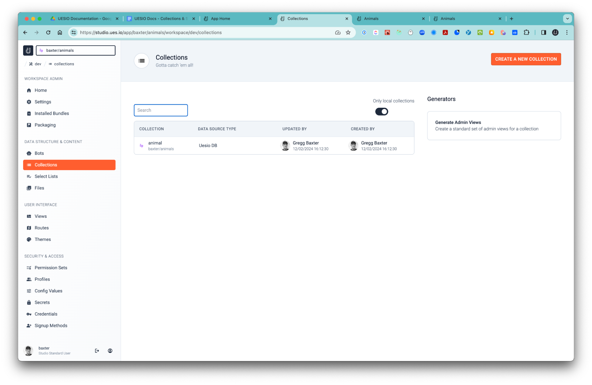
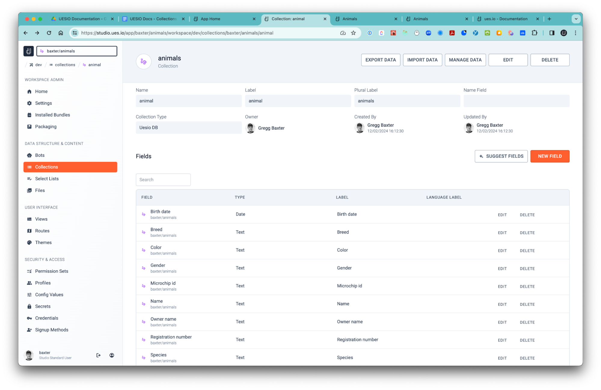
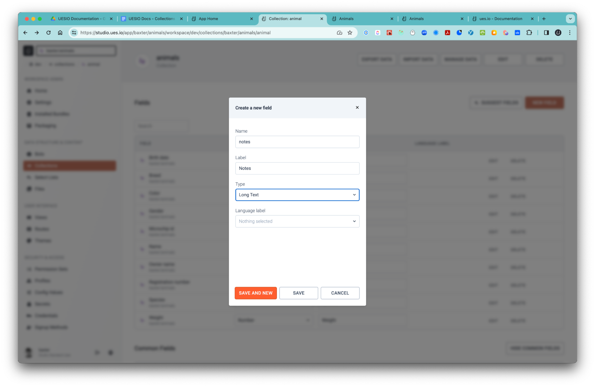
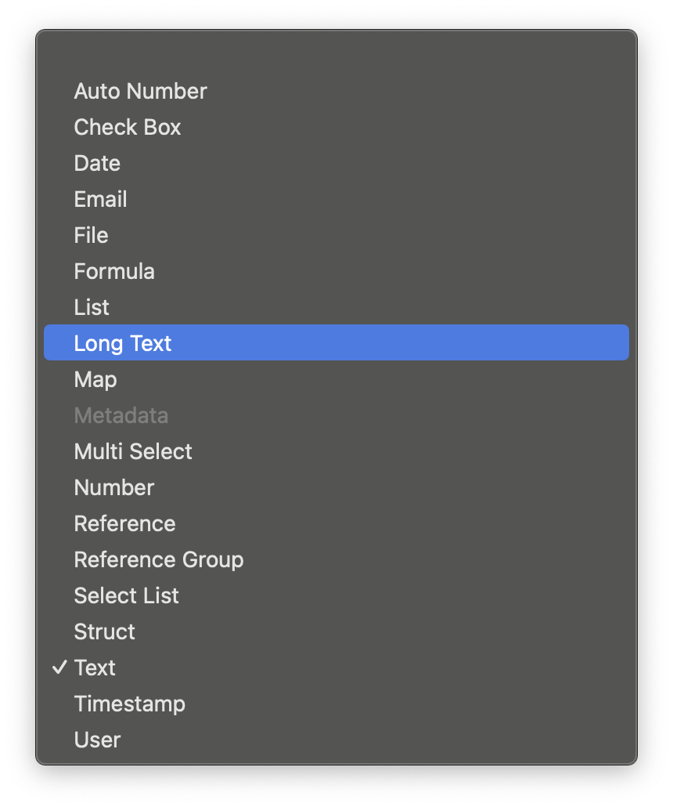
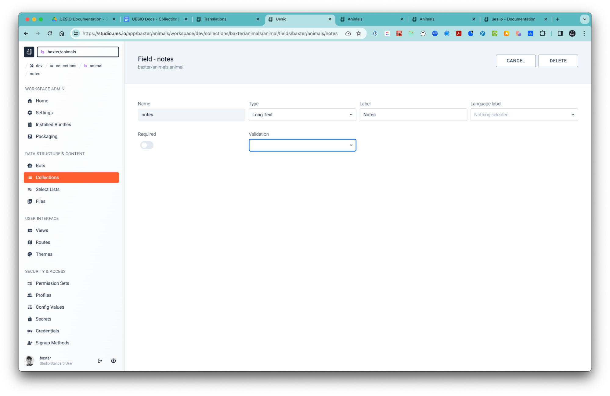

Collections are where you define your data storage and the data schema. A schema defines the structure of the data, including:

-   Collections: Represent categories of information, like "customer" or "product."
-   Columns: Represent specific attributes within a table, like "customer name" or "product price."
-   Fields & Data types: Specify the format and limitations of data in each field (e.g., number, string, date).
-   Relationships: Define how collections connect to each other (e.g., one customer can have many orders).

*   We are going to step through the following concepts:

1. Create a Collection
2. Manage Data
3. Create Fields
4. Field Types
5. Languages
6. Editing a Collection
7. Admin Views
8. Collection Relationships
9. Collections in the View Builder
10. Select Lists
11. Multi Select Lists

## 1. Create a Collection

-   To create a collection click navigate to a workspace and click on the ‘collections’ breadcrumb.

-   In our ‘Create your first app.’ tutorial we created a collection for our animals app. We also used AI to auto generate some fields for us.

-   Select the ‘animals’ collection.

## 2. Manage Data

-   Here we can export, import and manage our data as well as edit the collection and even assign a ‘name’ field to the collection. Names often play a crucial role in establishing relationships between different fields or even tables within the schema.
-   They act as foreign keys, enabling data joins and aggregation across various parts of the schema.

## 3. Create Fields

-   Select the ‘NEW FIELD’ button.
-   Type the name, in this case ‘notes’ and enter ‘Notes’ in the label. The label will be used to refer to the field when building out views i.e. when you insert a table component and connect the collection to the table and then add fields to the table.
-   The ‘name’ will be used when referencing the field programmatically or in a syntax when editing a view in YAML as one example.

## 4. Field Types

-   Select a type for the field definition to match the type of data you wish to work with. In this case because we are making notes about the animal we will choose the ‘Long Text’ option.

-   When you create a new field you can choose a type from the drop down menu.

## 5. Languages

-   The language label option ties in with the Translations functionality in the view builder where you can define up to 8 different languages and then assign specific labels to them and when your user has their system language set to a predefined language you have set then the labels will be displayed in their language.
-   For now we will leave it blank and select ‘SAVE’.

## 6. Editing a Collection

-   If you need to edit the field you can select the ‘EDIT’ button in line with the field and select the ‘EDIT’ button.

-   Here you can change the Type, the label, the language label but you cannot change the name. To change the name you will need to delete the field you created and create a new one with the name you prefer.
-   You can also make the field required which means that a user will have to update the field with data in order to save the record.
-   You can set field validation with Regex, Metadata or YAML.

## 7. Admin Views

-   We can also create Admin views for the collections we create by selecting the button on the right of the Collections View with our View Generator. This will automatically create lists, queues and detail views and routes that you can use to administer your test data.

## 8. Collection relationships

-   One-to-Many (parent-child)
    Collections can be used stand alone or be connected to another collection by means of a reference/lookup field. For example, if we create a new collection called ‘offspring’ where we will store the data of the offspring of each animal, should they have any.
    This will create a one-to-many relationship between the animals collection and the offspring collection so that we can view all the offspring data related to a single animal.

-   Many-to-Many (junction)
    We can create a collection that connects two collections to each other. In a data schema, a junction collection acts as a bridge between two other collections that have a many-to-many relationship. This means that a single record in one collection can be associated with multiple records in the other collection, and vice versa.

-   Here's how it works:
    Imagine you have:
    Students object with attributes like name, grade, etc.
    Courses object with attributes like title, instructor, etc.
    Now, a student can take multiple courses, and a course can have multiple students. If you simply use one-to-many relationships (e.g., a student belongs to one course), you'd end up with duplicated data (e.g., listing the same student for each course they take). This is inefficient and messy.
    Instead, you can use a junction object:
    Create a new object: Let's call it Student_Course.
    Add foreign keys: This object will have two foreign key fields, one referencing the Students table and another referencing the Courses table. These keys link individual student and course records to a specific enrollment instance.
    Additional attributes (optional): You can also add additional attributes to the junction object to capture specific details about the relationship, such as the enrollment date or grade received.
    Now, every record in the Student_Course object represents a unique association between a specific student and a specific course. This eliminates data duplication and simplifies querying and managing the relationships

## 9. Collections in the View Builder

-   Collections can be added to the data components in the view builder via the ‘Wires’ tab and various attributes can be set to control the behavior and data conditions for filtering. The Data section under the COMPONENTS tab can be connected to a collection via the wires.

## 10. Select Lists

-   In user interfaces, a select list can represent a dropdown menu, combo box, or similar control where users choose from a predefined set of options.
-   This select list can be stored in the data schema by creating a separate table dedicated to these options. This table typically has two columns: one for the unique identifier (ID) of the option and another for the human-readable label displayed to the user.
-   When populating the user interface control, the application fetches the labels from the options table and associates them with their corresponding IDs for further processing.
-   Because we use a Gender field for the Animals we can create a select list instead so that when the user is creating a record it will be quicker to select the Gender from a select list than having to type it out every time.
-   Create a Select List
-   Navigate to a workspace and select the ‘Select Lists’ breadcrumb and then ‘CREATE A NEW SELECT LIST’.
-   Enter ‘gender’ for the name and the select the ‘+’ twice and add the label names and values for Male and Female then select ‘SAVE’
-   Now head over to the Collections section in the workspace you created the Animals collection and select the Animals collection and then edit the gender field.
-   Change the ‘Type’ from ‘Text’ to ‘Select List’ and then select the ‘gender’ select list and the ‘SAVE’
-   Head back over to the collections list and select the Animals collection and then select the ‘MANAGE DATA’ button and you will see that the field ‘Gender’ now has the select list in place with the matching values for each as well as a None Selected option until the user has selected one. And of course you can create a validation on the field level to make sure that the user does select something.

## 11. Multi-Select Lists

-   This can be helpful if you want to give the user a few options to quickly select at the same time. For example, if the animal likes to eat plants or meat or dry food then you could select one of those values but if the animal likes plants and dry food then the user can select both options or any combination of. To create a multi-select list you need to head over to the workspace and the ‘Select Lists’ section and create a new select list called food_type with the options Dry Food, Plants and Meat. I created a blank option called ‘Anything’ so that the user is not required to enter a value.
-   Then head over to the collections section, select the ‘animals’ collection and then select the ‘NEW FIELD’ button.
-   Give the new field a name called ‘food_types’, a Label called ‘Food Types’ and the Type as ‘Multi Select’ and then choose the Select List we created called ‘food_type’ and ‘SAVE’
-   Next, when you select the ‘MANAGE DATA’ button after you have clicked on the Animals collection and then the ‘CREATE’ button you will see the field is a multi select type field.
-   If you create a new view and insert the multi select field into the view it would appear with all the options in the row.
