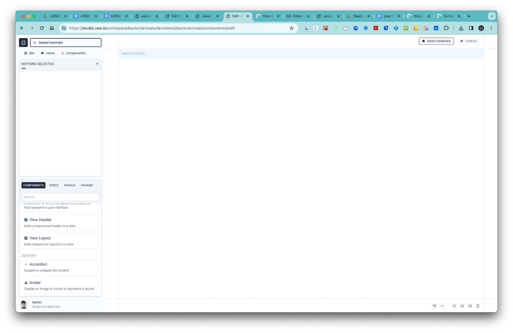

Components are building blocks for your application and which can be used and for app assembly in the View Builder. Components can be inserted either by double clicking or simply by drag and drop and placed in the View Builder canvas. Most components have attributes that you can set including styling.

Some components can be connected to your data collections via wires and some can execute signals/actions to perform a variety of tasks. You can also set a display condition so that the component appears and disappears according to a condition.

There are many components to choose from and if you don’t find something, or you prefer to make your own components, then you can do so using the ues.io CLI and your favorite code editor.

#### The following come pre-loaded in the View builder and are grouped as follows:

1. Layout
2. Content
3. Data
4. Interaction
5. Visualization

## 1. Layout

Used to produce high definition user interfaces with structured layout and responsiveness where desired.

-   Box  
    Used for formatting and grouping components.
-   Grid  
    Used to position components in a grid format.
-   Group  
    Used to group components side by side.
-   Scroll Panel  
    Used to manage overflow. Includes a header, footer and content area.
-   Tabs  
    Used to group different views or components with a title tab for each.
-   View  
    Place a View you created into the current View you are creating.
-   View Header  
    Easily build a structured header with a logo area, left, right and center aligned content and an avatar area.
-   View Layout  
     Comes with a view header and additional layout structure for header, left panel, main, right panel and footer contents.

## 2. Content

Great for creating rich views including video and images and much more.

-   Accordion  
    Handy to hide and expose sections of the screen.

-   Avatar  
    Use this to expose the user avatar in the view.

-   Code  
    Used to place code in the view builder and can be formatted in TypeScript, YAML, JSON, JavaScript, CSS or HTML.
-   Image  
    This is used to place an image in the View which can be selected from the files that you uploaded in the Files section in your Workspace.
-   Link  
    Used to create a hyperlink.
-   Markdown  
    Great for quick formatting and can also be uploaded from a file.
-   Text  
    Used to display Text in the View.
-   Tile  
    A clickable tag representing a record.
-   Title Bar  
    Used for titles like View title: HOME VIEW
-   Video  
     Run video in your view. Can be from a file or a URL.

## 3. Data

These components can be connected to a wire that you create in the View Builder that is connected to a data Collection.

-   Deck  
    Iterate over data and render the contents in a grid layout.
-   Field  
    Insert a field and connect it to a wire to display the data from the collection connected to the wire.
-   Item  
    Render child components in the context of a specific wire record.
-   List  
    A list is used to display rows and columns of data but without column headers. You can also nest fields within columns.
-   Table  
    A Table is used to display rows and columns of data with column headers.

## 4. Interaction

Interactions are very useful for creating short workflows that run in the front-end using Signals. There are many signal actions for a fine grained user experience.

-   Button  
    Fire off a Signal action when the user selects the button. You can also make use of the display conditions to expose different buttons according to a state or data values.

-   Filter  
    Used to activate and apply a condition on a Wire to filter data.
-   Search Box  
    Connect the Search Box to a Wire and search for data records. Other components using the same Wire will display the searched items. Set the specific fields you want to search for.

## 5. Visualization

Used to create charts and KPI screens.

-   Bar Chart  
    Use series and categories to create visual Bar Charts.
-   Line Chart  
    Use series to create visual Line Charts.
-   Metric  
    Create numerical representations and actions for KPI screens.
-   Metric Group  
    Group Metrics can be connected to Wires and Collection data for highly configurable KPI screens.
