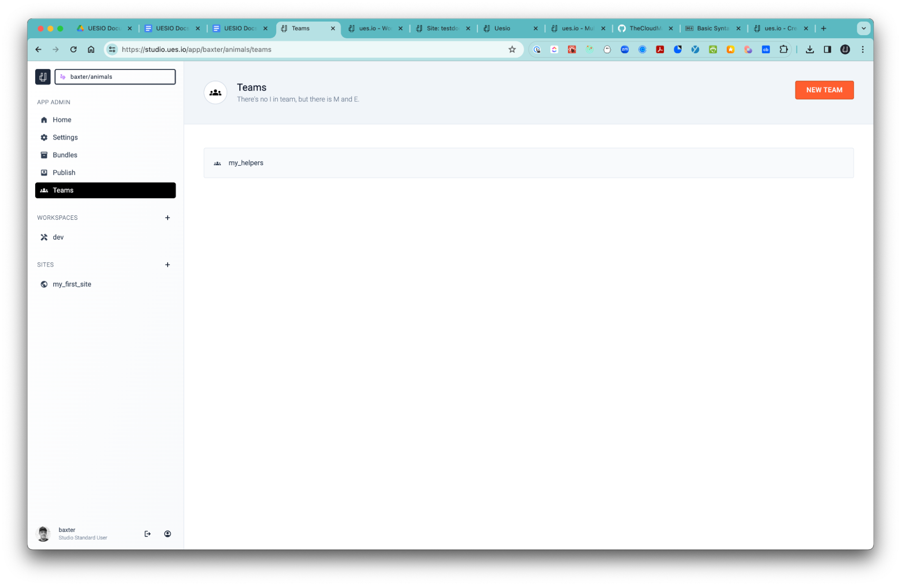

# Files

-   Upload files for logos or any graphic items you would like to expose in your App Views you create in your workspace.

1. Upload a File
2. Use the File in the UI

### Upload a File

-   Head over to your workspace and select the Files breadcrumb and select the ‘CREATE A NEW FILE’ button.
-   Give the file a name like ‘logo1’ and select ‘SAVE’
-   Now either drag your file into the ‘Click or drag your file here to upload’ area or click on the area and select your file from your local drive.

### Using a File in the UI

-   Now you can head back over to your workspace and select the ‘Views’ breadcrumb and select the ‘animal_list’ view and then the ‘BUILD’ button.

-   Go to the Components section and select the ‘Image’ component and drag it into the top left panel of the page layout and then select it in the Component INdex section and select the ‘logo1’ file, set the parameters and press ‘SAVE CHANGES’.
-   Then select the ‘PREVIEW’ button and your image will be visible.
