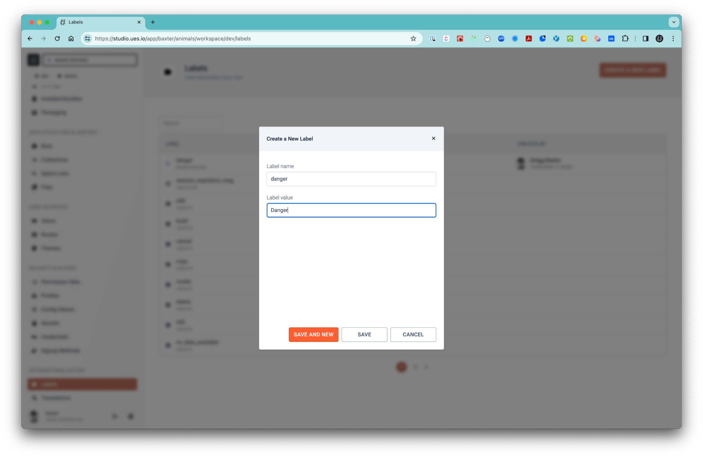
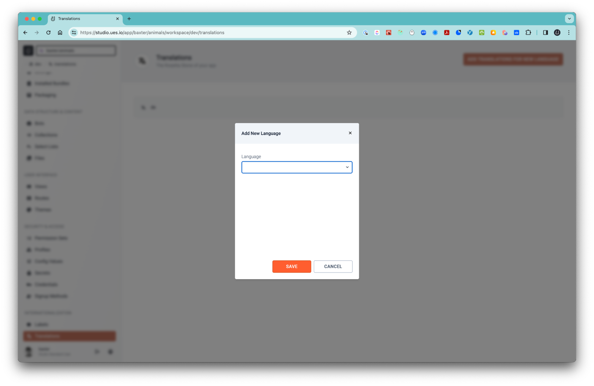
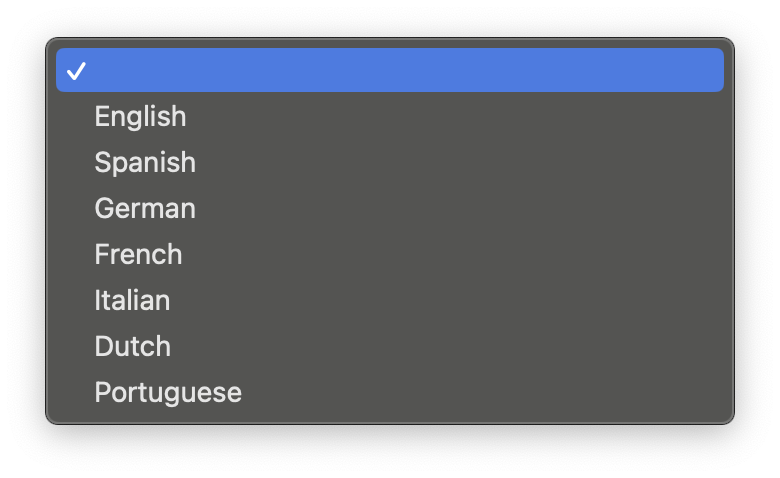
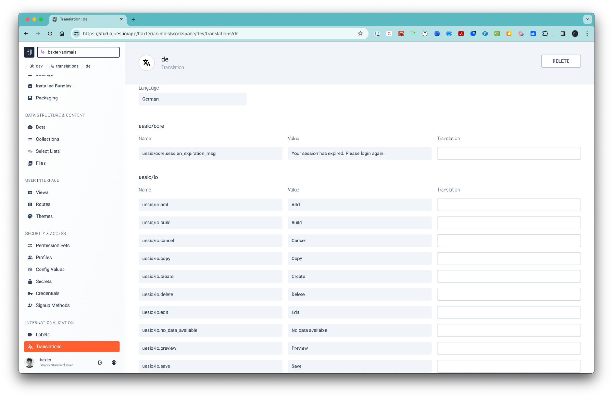

# Labels and Translations

This is a really handy feature if you are building apps for different countries or people of different languages. ues.io checks the language setting of the user's local machine and then applies the language and the translated labels in the application user interface. Currently there are currently 7 supported languages:

-   English
-   Spanish
-   German
-   French
-   Italian
-   Dutch
-   Portuguese

1. Create Labels
2. Create Translations

## 1. Create Labels

-   There are 11 default labels such as Create, Delete, etc. that can be translated in your chosen language.

-   If you need more labels for your Button actions or Field labels or elsewhere then you can create a new label.

## 2. Translations

-   In your Workspace select the ‘Translations’ breadcrumb and ‘ADD TRANSLATION FOR NEW LANGUAGE’ button and choose the language you want to use.

-   Next you will see a view where you can translate the standard ues.io labels and any other labels you may have added to the system.

