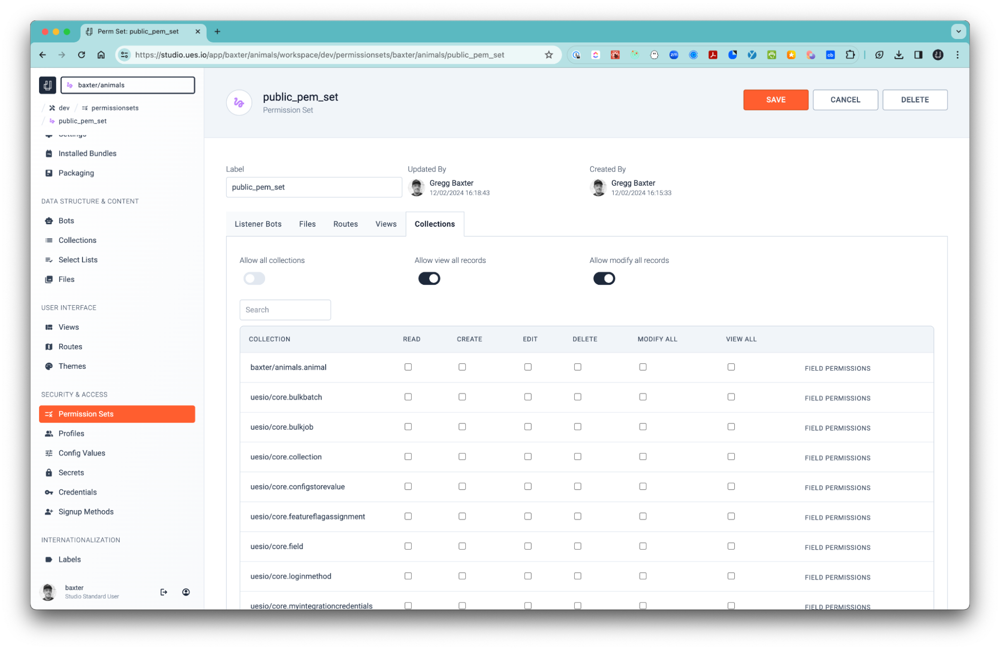
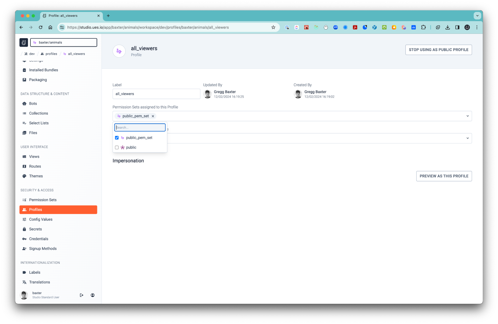

This is one of the places where ues.io shines above many other application building platforms. You can fine tune what users can do with their data in terms of their rights to perform updates, deletions, creating or viewing data.

1. Permission Sets
2. Profiles

## 1. Permission Sets

#### Permission Sets are categorized and configurable according to the following areas:

-   Listener Bots  
    If you have built any Bots you can select which ones are accessible for the permission set.

-   Files  
    Files uploaded in your Workspace can also be controlled in terms of access.

-   Routes  
    Routes to your views, Bots or URL’s can be configured for accessibility.

-   Views  
    Determine which Views you want to allow the permission set to govern.

-   Collections  
    You can set the permission set to allow all collections and view or modify all records.

-   You can also set read, create, edit, delete, modify all or view all Collections.
-   You can also set the field permissions to read and edit on the field level.

## 2. Profiles

-   For most applications you will need a super user, normally called the Administrator, to perform sensitive tasks and have access to all sensitive data allowed. Of course you will also need a Users profile.

-   After you have created a profile you can attach permission sets, one or many, to that profile.
-   When you create your users for your Site, either manually or with self-signup, you can allocate a Profile with the attached Permission Sets to that user ensuring that they have a safe user journey.
