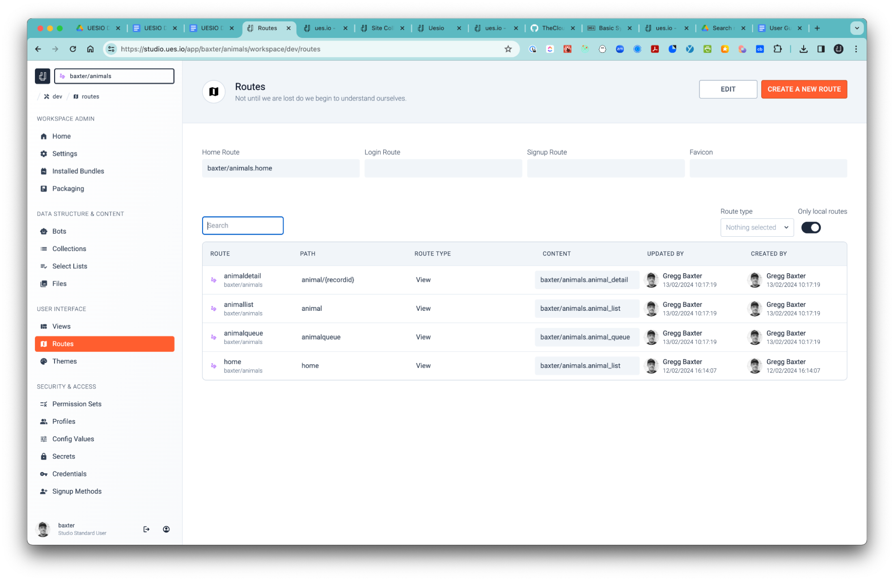

# Routes

-   See routes as the path that the user will use to reach the Views you have created. If you create a route path called ‘planets’ and set the view to a view you created called ‘planetlists’ then the user will reach that view at `mysitesubdomain.ues.io/planets`.

-   Routes can be created for redirects and bots and configure which Theme to apply to the View you are publishing at the end of the Route Path.

1. Create a View Route

-   While in your workspace select the ‘Routes’ breadcrumb.
-   Select the ‘CREATE A NEW ROUTE’ Button.

-   Give your route a name. I used ‘all_animals’. (Assuming you have already created the animals app.)
-   Select the route type as ‘View’.
-   Enter the URL. I chose ‘allanimals’.
-   Choose a View for the route. I chose ‘animal_list’.
-   Select ‘GENERATE’ and then you will see the route in your routes list.
-   Select the route you just created ‘all_animals’ then select the ‘PREVIEW’ button and then you will see your view that you assigned to the route.
