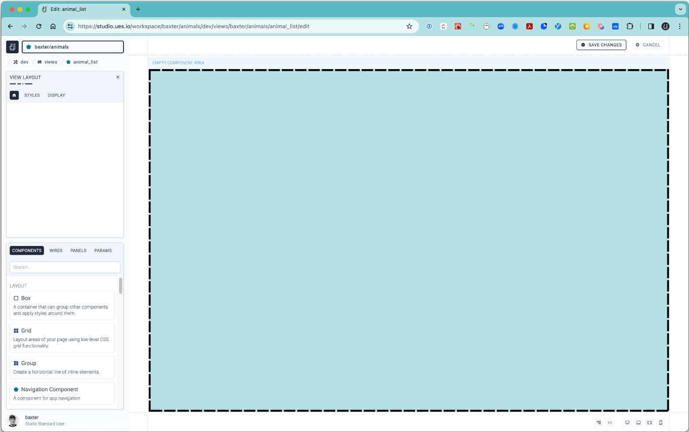
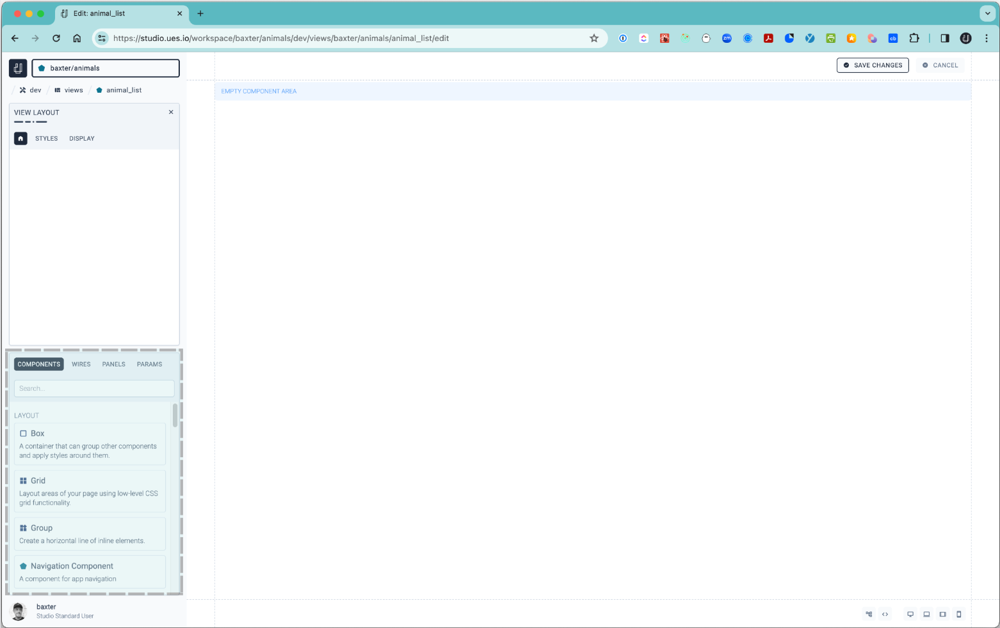
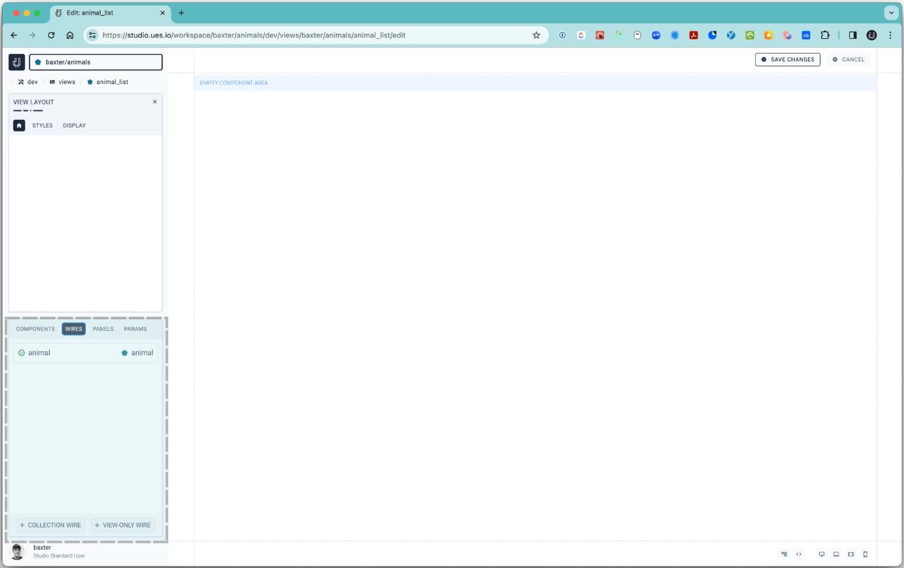
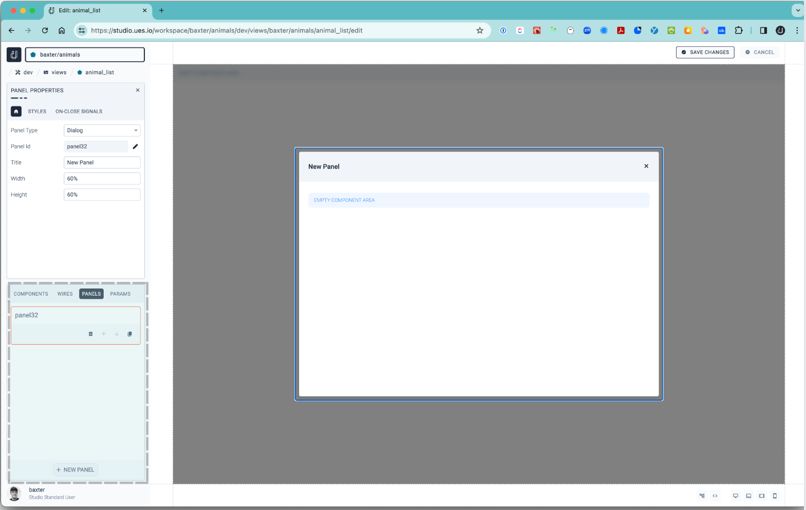
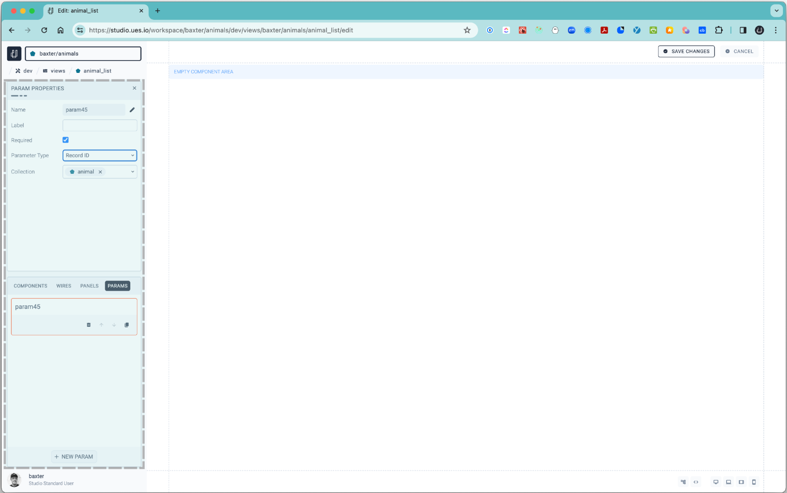
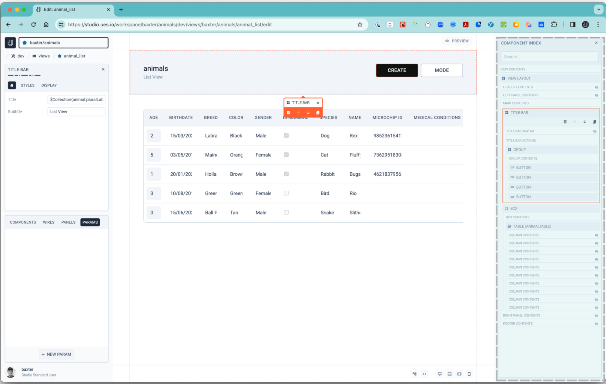

# Views

This is where all the action happens. Here you can configure the user interface and the different components within each view as well as the wires that connect your data to the different components.

-   Create different views for your apps. You may want to create a list view to show rows of all data items from a particular data collection source or a form view to see more details of a specific row of data. Here you will see a list of all views you have created in this workspace.

-   Once you have selected a View you can directly edit the YAML that defines the view if you need to change something quickly programmatically or ‘PREVIEW’ or ‘BUILD’ or ‘DELETE’ the View.

-   Create a New View  
    Select this option to create a new View and start building immediately or select a view generator and let the system create a default list, queue or detail view based on a predefined collection you created. You can also head over to your collection you created and use the ‘Generate Admin Views’ button for each collection and the system will create a set of views and routes for you.

-   Select a View  
    Once you select a pre-created view then you will see a code window if you would like to edit the code that makes up the View or simply make adjustments to the View in the Build mode.
-   Preview  
    When you select a specific View you created then you will be able to preview your View in a separate window or if you would like to do this in Build mode then you can simply select the WYSIWYG icon or use a secret hotkey O'command+u' for a quick preview.
-   Build  
    This is where you enter the View builder directly for the selected view.

#### The View Builder

-   Preview Mode  
    Selecting this option displays your build in a WYSIWYG content view.
-   HOTVIEW – “COMMAND+U”  
    For a quick live preview of your View you are building your view..
-   Code Window – “COMMAND+Y”  
    Expose the code used to build the current view and make edits directly to the View.
    Component Index – “COMMAND+I”  
    This is where you can see the index of all the components in your builder view. You can select a component and then adjust its properties in the left panel.

### Studio View Builder

-   The Studio View Builder is a comprehensive UI design studio and is the heart of ues.io which stands for (U)ser (E)xperience (S)tudio.

Comprising of the:

1. Canvas Area
2. Components Section
3. Wires Section
4. Panels Section
5. Params Section
6. Code Window
7. Component Index
8. Preview

#### 1. Canvas Area

-   The canvas area is where you do your designing and user interface (UI) configurations. This is where you can drop your selected components and then configure them.

#### 2. Components Section

The [Components](components) included with ues.io are grouped by:

-   Layout
-   Content
-   Data
-   Visualization

#### 3. Wires Section

-   The [Wires](wires) section is where you connect your [Collections](collections) data sources to the Studio View Builder and the ‘DATA’ [components](components).
-   You can also create ‘VIEW-ONLY-WIRES’ and add view only fields and the same properties that are available in standard Wires.

#### 4. Panels Section

-   Panels are like miniature views that can be configured with components just like the Studio View Builder Views and are triggered to appear with a Signal action in the View either as dialogue or as a side Panel.
-   Some refer to them as pop-ups and they are great for showing smaller amounts of data without redirecting the user to a different view or for collecting information from a user like in a Contact Request form from your ues.io built website.

#### 5. Params Section

-   This is where you can configure the View to read information from the parameter in the URL to match it to the parameter you set in the ‘PARAM PROPERTIES’ section.
-   An example is if you have a table with rows of data and you would like the user to see a detailed view of that record then you would create a [Signal](signals) action attached to a ‘Row on-click’ action to ‘Navigate to route assignment’, select a [Collection](collections), the ‘View Type’ to ‘Detail View’ and for the ‘Record ID’ set the value to ‘${uesio/core.id}’ which will then include the Record ID in the URL when the user clicks that row. Something like this ‘/animal/018db6f7-3a92-7d76-b01d-3ef32c4676bc’ will be passed in the URL to the detail view.
-   The View you create as the detail view would then have the parameter properties set to ‘Required’ checked, parameter type ‘Record ID’ and the ‘animal’ collection we created in the [Create your first app](create-your-first-app) section in the documentation.
-   The Route for the detail view should be appended with ‘{recordid}’ so that the path looks like this: ‘pathname/{recordid}’ so for our animals detail view the path is ‘animal/{recordid}’.

#### 6. Code Window - (command+y)

-   The Code Window offers the ability to customize your View layout even deeper using YAML. - - After you open the Code Window and click on a component then the piece of code that represents the component you clicked on will be highlighted in the Code Panel and vice versa.
-   Because our runtime decodes the YAML ‘on-the-fly’ any changes you make to the code will immediately translate into the View.
-   To access the code window you can select the ‘<>’ icon on the bottom right of the screen or with the hot-key ‘command+y’ keyboard keys.

#### 7. Component Index - (’command+z’)

-   The index typically gives you a representation of the order of your components in your View. - - The index can be found on the bottom right hand side of the Studio View Builder on the icon that signifies some blocks or with a hot-key ‘command+z’ keyboard keys.
-   As with the Code View, when you select a component in the View it will be highlighted in the Component Index panel and vice versa.
-   You can also select the tiles in the Component Index and drag them into different positions or select a tile, like a box, and then ‘double-click’ on a layout component in the components panel on the left to insert it into the box selected in the Component Index.

#### 8. Preview - (command+u)

-   This is another place where ues.io shines above the rest. To quickly see a preview of the View you are building you can simply click on the ‘PREVIEW’ button on the top right of the canvas or use the hot-keys ‘command+u’ to toggle between the View builder and the preview.
