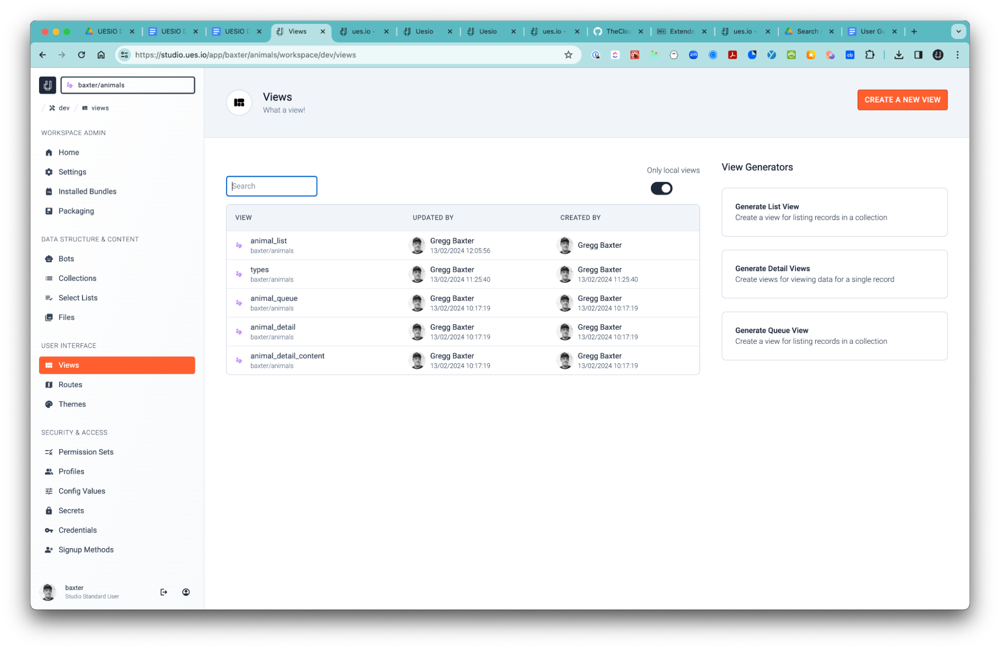
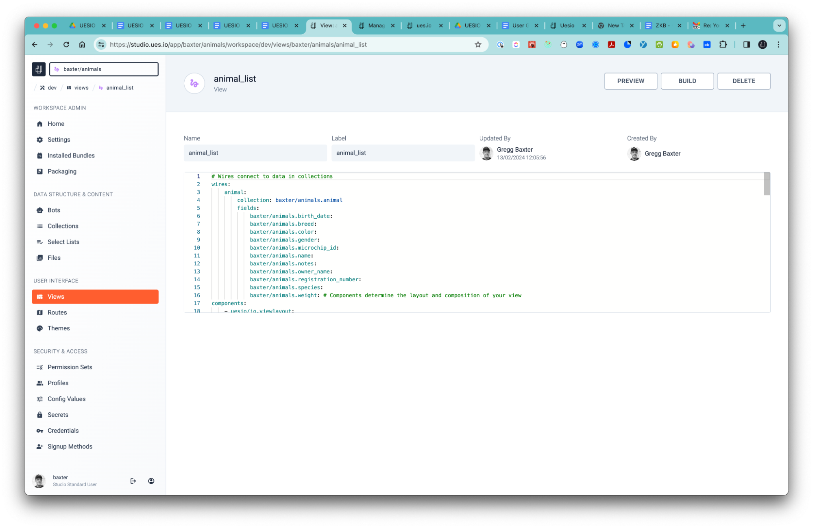
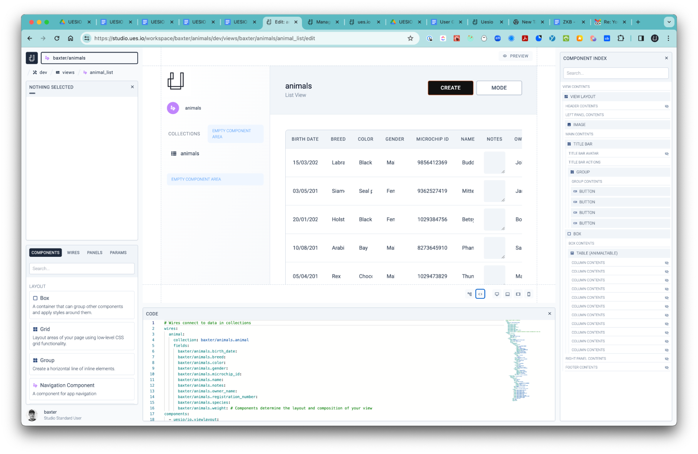

# Views

This is where all the action happens. Here you can configure the user interface and the different components within each view as well as the wires that connect your data to the different components.

-   Create different views for your apps. You may want to create a list view to show rows of all data items from a particular data collection source or a form view to see more details of a specific row of data. Here you will see a list of all views you have created in this workspace.

-   Once you have selected a View you can directly edit the YAML that defines the view if you need to change something quickly programmatically or ‘PREVIEW’ or ‘BUILD’ or ‘DELETE’ the View.

-   Create a New View  
    Select this option to create a new View and start building immediately or select a view generator and let the system create a default list, queue or detail view based on a predefined collection you created. You can also head over to your collection you created and use the ‘Generate Admin Views’ button for each collection and the system will create a set of views and routes for you.

-   Select a View  
    Once you select a pre-created view then you will see a code window if you would like to edit the code that makes up the View or simply make adjustments to the View in the Build mode.
-   Preview  
    When you select a specific View you created then you will be able to preview your View in a separate window or if you would like to do this in Build mode then you can simply select the WYSIWYG icon or use a secret hotkey Option+U (for Ues.io) for a quick preview.
-   Build  
    This is where you enter the View builder directly for the selected view.

#### The View Builder

-   Preview Mode  
    Selecting this option displays your build in a WYSIWYG content view.
-   HOTVIEW – “COMMAND+U”  
    For a quick live preview of your View you are building your view..
-   Code Window – “COMMAND+Y”  
    Expose the code used to build the current view and make edits directly to the View.
    Component Index – “COMMAND+I”  
    This is where you can see the index of all the components in your builder view. You can select a component and then adjust its properties in the left panel.
